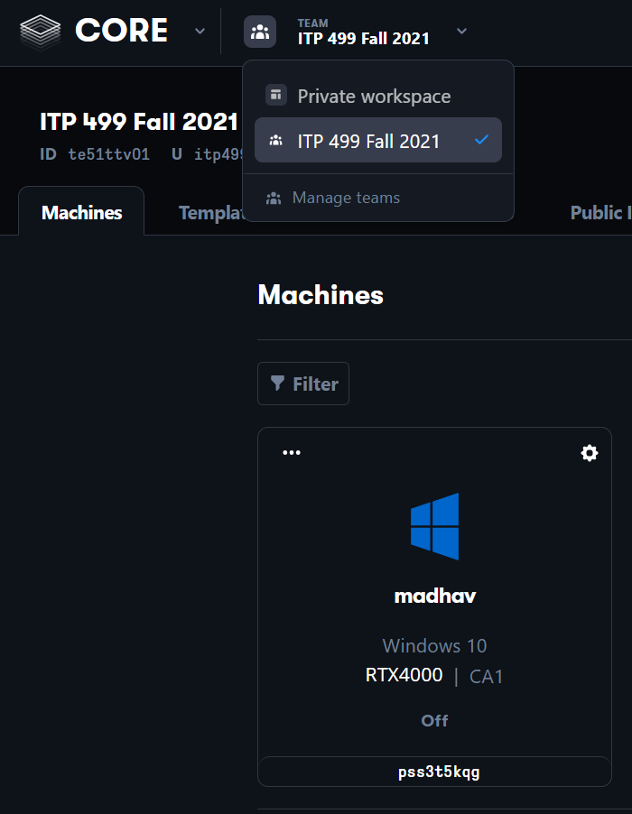
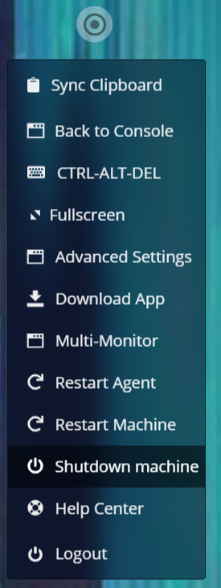
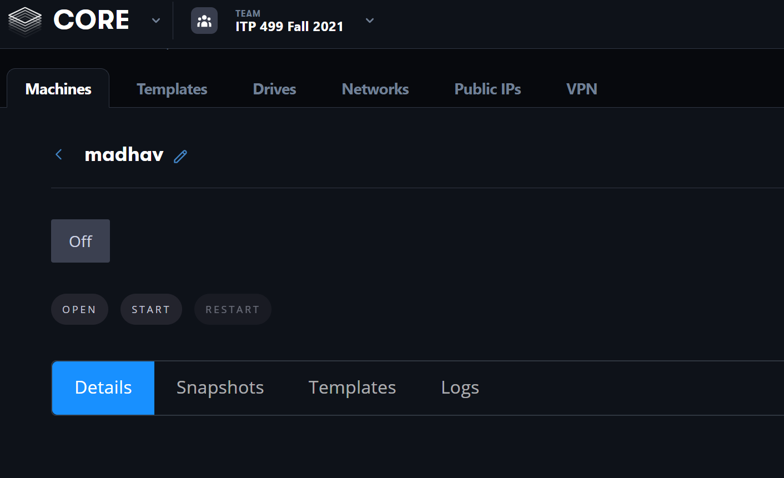

# Connecting to Your VM

## GitHub

We will still use GitHub in this class for your grade reports (via issues). Please accept the following GitHub assignment: [https://classroom.github.com/a/QuXeJv-D](https://classroom.github.com/a/QuXeJv-D). You won't need to submit any code to this repository during this semester, but you will want to check it every week for your grades.

## Paperspace

You already should've received an invite to join the Paperspace Team via your USC email, if you've not, please let me know. The email will guide you through creating your account, but you still need to manually [accept the team invite](https://support.paperspace.com/hc/en-us/articles/360014816694-Joining-a-Paperspace-Team) under "Manage Teams".

1. Go to the [Paperspace site](https://www.paperspace.com/) and sign in using your USC email
2. In the console, make sure you select "CORE" and the ITP 499 Fall 2021 team (yes, the team is still called this even though it's ITP 438 in a different semester):
   
3. You should have access to a VM with a name corresponding to your USC account name. If you don't, it means I haven't set it up yet, in which case please post a request on the Piazza thread for VMs.
4. Click on the VM and then click the startup button that shows up. It will take a minute or two to start up for this first time.
5. Once the VM finishes startup, you should be in Windows 10
6. Near the top right corner you'll see a icon with some concentric circles. Click on this to see your Paperspace options. You should go into "Advanced Settings" and enable "Gamer Mode"

{: .warn }
Paperspace bills by usage. In order to make sure that you do not have extreme overages, you ***MUST*** shut down your VM instance when you are not actively using it. Get in the habit of always shutting down when you're done with your session. If you end up with overages you may lose VM privileges for the semester, in which case you would have to do all development on your own machine instead.

To shut down your VM, you can use the Paperspace menu and select "Shutdown machine." Make sure to always do this when you are done working, as noted in the warning above:

You can also shut down your VM using the normal shut down option in the Start Menu.

Then, return to the console view with "Back to Console" and confirm that your Machine is in the "Off" state.

## Setting up Parsec

Although you can use the Paperspace client through the browser to connect to your VM for development, it can have noticeable lag at times, which makes it annoying to use. Because of this, we recommend that you instead use Parsec to connect to your VM.

To do this:

1. On your local machine, go to [https://parsec.app/](https://parsec.app/) to register for a free account and download the client
2. Install the client on your local machine and run Parsec. Login with your account (it may ask you for an email confirmation)
3. Start up your VM and connect through Paperspace
4. Your VM already has Parsec installed
5. Open up Parsec and login with the same account (again, you may have to confirm via email)
6. Now from the Paperspace menu select "Back to Console." ***This will leave your VM running***.
7. Now from your local Parsec client, connect to the Paperspace machine. You should now be in your VM and can use it!
8. When you are done working, while connected through Parsec, go to the start menu and shutdown the machine
9. Parsec will disconnect shortly after shutting down
10. Now from the Paperspace console webpage, confirm that it says that your VM is "Shutting down". After a few seconds it should refresh to "Off":
    

## Using Parsec

The normal workflow for using Parsec is:

1. From the Paperspace console, click "Start" on your VM
2. Once the VM shows that it's ready, connect to it from your local Parsec client
3. When you are done working, shut down the VM from Parsec
4. Verify in the Paperspace console that your VM is off

{: .danger}
Remember, it is critical that you make sure you shut down your VM whenever you finish your work session. We have a limited budget so please do not waste the budget by keeping your VM running non-stop. Always check after you're done working that your VM is shut down!

Now you're ready to [Set up Perforce](00-02.html)
