# Connecting to Your VM

## GitHub

We will still use GitHub in this class for your grade reports (via issues). Please accept the following GitHub assignment: [https://classroom.github.com/a/QuXeJv-D](https://classroom.github.com/a/QuXeJv-D). You won't need to submit any code to this repository during this semester, but you will want to check it every week for your grades.

## Virtual Studio

After the first class meeting, I will send you an email with your personal username/password for the Virtual Studio system we're using. If you added after the first day of classes, please let me know either in person or on Piazza so I can get you setup.

Once you have the credentials, you will need to through a website console once before you can start using Parsec to connect to your VM.

1. Connect to [https://usc1.cgcloud.centergrid.com](https://usc1.cgcloud.centergrid.com)
2. Login using your credentials (in this example, we logged in as `student-12`):
   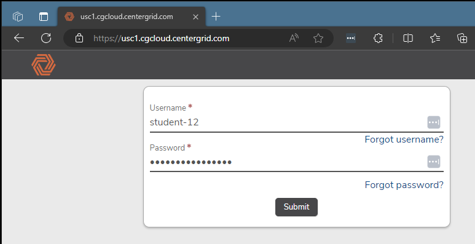
3. After connecting, you will be presented with your assigned Virtual Studio workstation:
   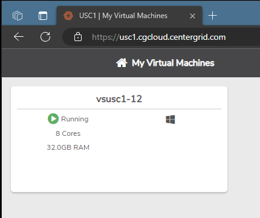
4. Click on the workstation to access the console. It should take you directly to a Windows login screen in the browser, like this:
   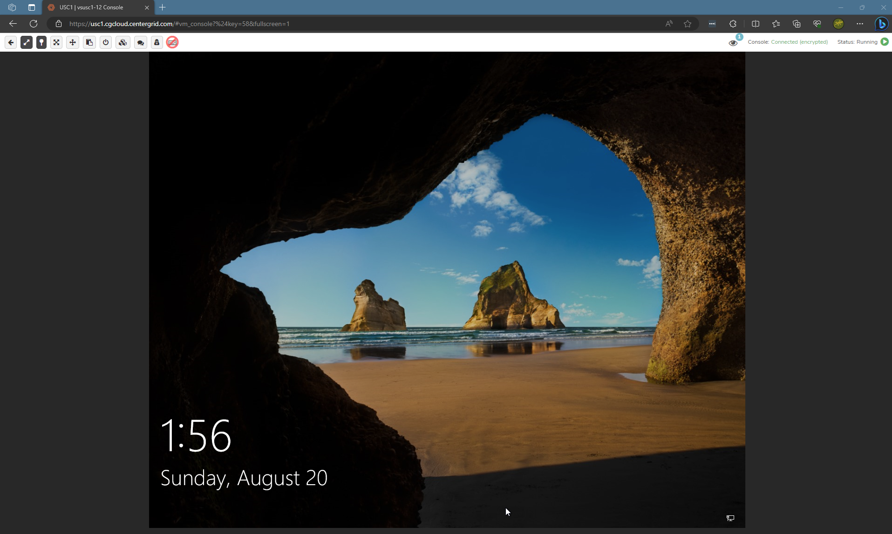
   1. If for some reason, you instead see this:
      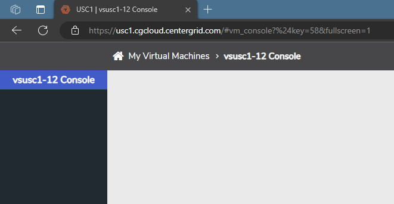
   2. You can click on this button to get to the console login screen:
      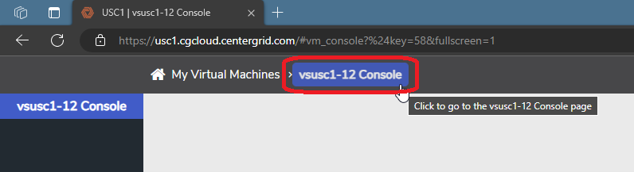
5. Once on the login screen, double-click on the screen to bring up a login prompt:
   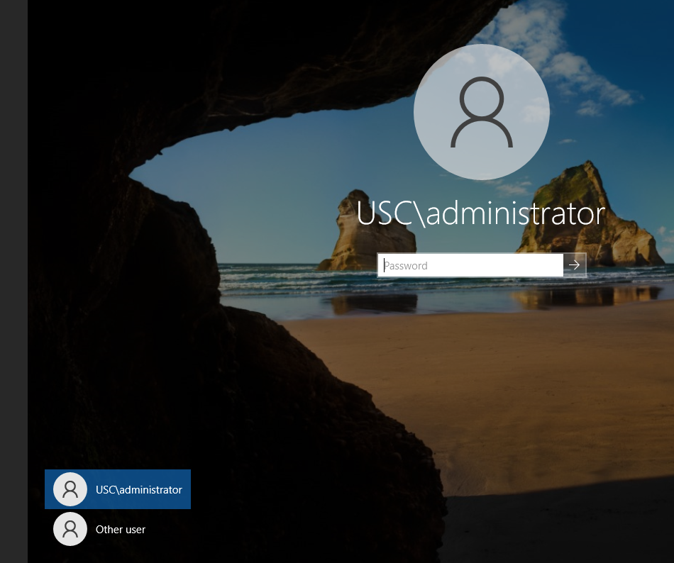
6. You may notice that the console is very sluggish. Don't worry -- this is expected and will not be an issue once you are connecting through Parsec.
7. Click on the "Other User" button on the login prompt.
8. Type in your username. Your username will have `USC\` prepended to it. For example, if your username was `student-12`, your login at this prompt is `USC\student-12`:
   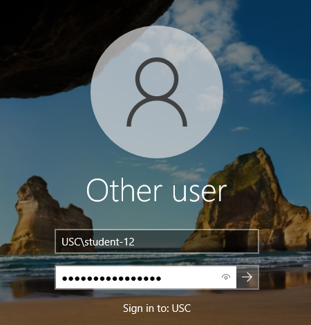
9. Although you can type in your password manually, it may be easier to take advantage of the clipboard in the console:
   1. First, make sure your text cursor is on the Windows login password prompt
   2. Click the clipboard button on the toolbar at the top of the web console:
      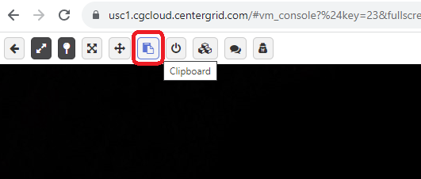
   3. Paste your password into the text box and then click the "Paste in Console" button:
      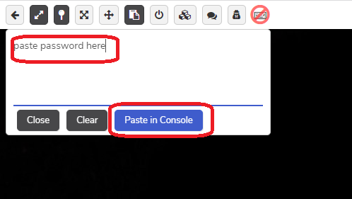

10. Once your password is in, login to Windows
11. On the first login, it will ask you to select a new password for the Windows login. The password must:
    1. Contain an uppercase letter, lowercase letter, number, and special character (do not use a `+` symbol)
    2. Be 14 characters long

{:.danger}
You should not use your USC password or reuse any other password. I recommend using a password manager to generate and save your password. If you forget your password, there will be some turnaround time for support to reset your password, so please save it somewhere secure so you are able to easily access it. Also, note that this password is ***NOT*** synchronized to your password for the Virtual Studio page -- that password will remain the same even after you change the Windows one.

The first time you login, it will take a couple of minutes to create your local profile. Once it finishes, it's time to setup Parsec.

## Setting up Parsec

Parsec allows for low-latency remote desktop between your machine and the remote Virtual Studio machine. Under normal network conditions, it will run almost as smoothly as a local machine would, even when playing games.

First, on your local machine:

1. If you don't already have an account, create a free one at https://parsec.app/
2. Download the Parsec client from the website and install it
3. Run Parsec and login with your account. It will most likely ask you for an email confirmation since it's the first time you're logging in from an IP address. After the confirming from the email, click the log in button again.

On the Virtual Studio machine:

1.  Find the Parsec icon on the desktop and double-click on it to open:
   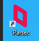
2. Login using the same Parsec account you logged into on your local machine
3. It will most likely ask you for an email confirmation again since it's a different IP address than your local one. After the confirming, click the log in button again.

Back on your local machine:

1. Confirm that you can see your Virtual Studio machine as a computer on Parsec:
   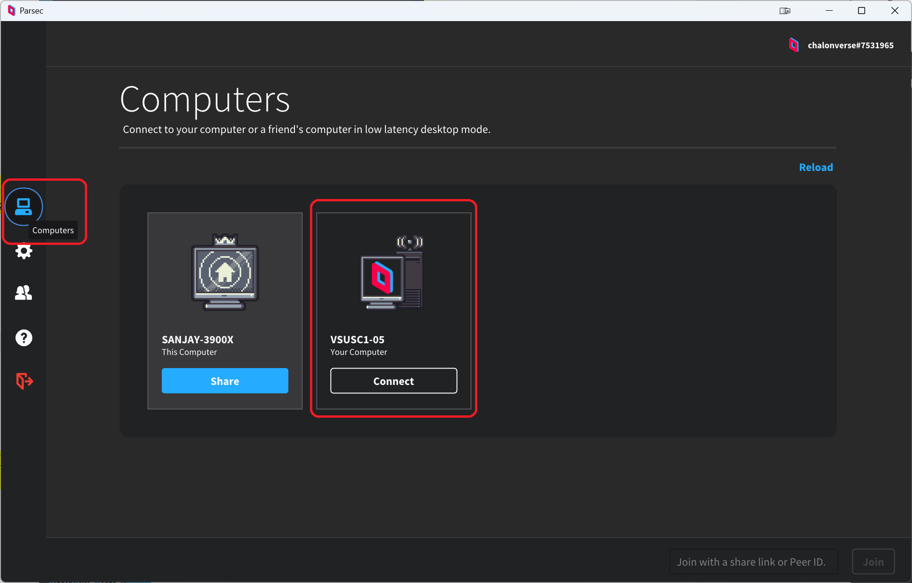

{:.danger}
If you don't see the machine listed, please confirm you're logged in to the same account on both machines before proceeding.

Back on the Virtual Studio machine:

1. On the desktop, double-click on the icon that says "Run Me After Parsec Configured":
   
2. This reconfigures the Virtual Studio workstation to prefer Parsec, and cause the system to reboot.
3. Wait two minutes
4. From this point forward, you can connect through Parsec rather than needing to login through the web console

## Using Parsec

The normal workflow for using Parsec is:

1. Open Parsec on your local machine, and you should see the Virtual Studio desktop machine listed
2. If you don't see the machine, it may be powered off. To power on the machine:
   1. Go to [https://usc1.cgcloud.centergrid.com](https://usc1.cgcloud.centergrid.com) and login (remember your account password will not be the same as your password on the machine)
   2. If the machine is stopped, it will look like this:
      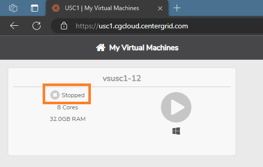
   3. Press the play arrow button to start the VM
   4. Wait two minutes
   5. In Parsec, click the "Reload" button and you should see your machine again
3. In Parsec, click on "Connect" under your VM's name
4. You should see the login screen. If you instead see a black screen, you may have to mess with the "Switch Display" option:
   1. Click on the Parsec icon on the black screen
   2. Select "Switch Display":
      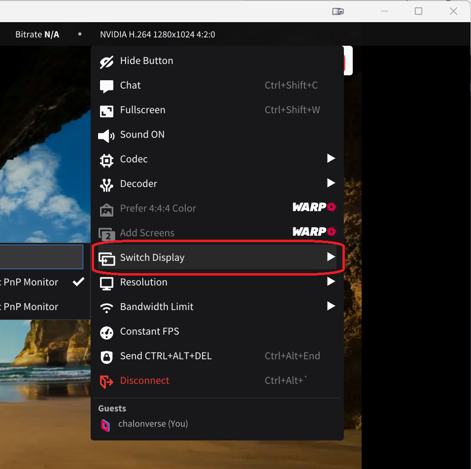
   3. Try changing it to the second monitor and then back to the original, and then you should see the login screen
5. Type in the username and password. Remember, the username is with `USC\` prepended, like `USC\student-12`. Your password is what you changed the Windows password to, which hopefully you saved in a password manager
6. You should now see your desktop

It's now time to [set up Perforce](00-02.html)
