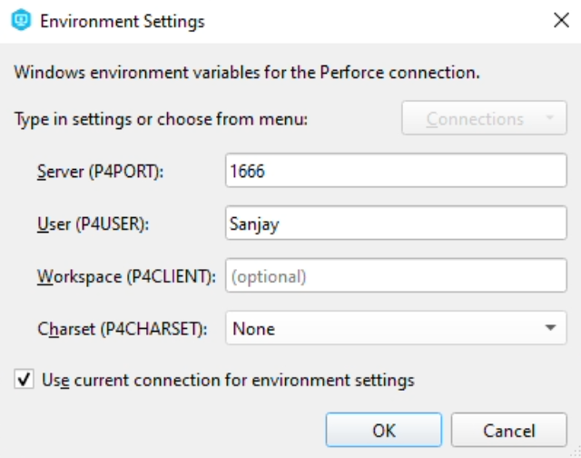

# Setting Up Perforce

Like Git, Perforce is a source control system. Perforce handles large binary files in a much more effective way than Git does, and for this reason Perforce is a very popular choice for game developers. While Unreal Engine does have some integration with Git, its integration with Perforce is much more robust as Epic Games uses Perforce internally.

Unfortunately, Perforce does not have a free site like GitHub which can host your repository. So, you'll be setting up a Perforce server on your VM.

{:.note}
Some of the instructions on this page are adapted from this [online resource](https://allarsblog.com/2017/04/05/populating-perforce-with-an-unreal-engine-source-build/).

## Running P4V (Perforce Client)

1. From the start menu, open the P4V client (you can just search for it by name)

2. You should see an "Open Connection" dialog

{:.note}
If you for some reason don't see P4V, it might accidentally not be installed on your VM. You can download and run [this file](https://www.perforce.com/downloads/perforce/r23.2/bin.ntx64/p4vinst64.exe) to install it (just leave all the install options as the defaults).

## Creating an Admin Account and Configuring Perforce

We now want to setup an account for you on your Perforce server and configure it to prevent unauthorized access.

{: .danger }
Save your Perforce admin username and password somewhere in a local text file so you do not forget it, because Perforce will require you to reenter the password if it's been more than 24 hours since your last login. Do not use your USC password. If you lose your Perforce password, it is impossible to retrieve and you will have to nuke your server and start over again.

1. In the "Open Connection" dialog, next to the "User" entry click the "New..." button:
   

2. Set your user name to what you want

3. Set your password to a password that has at least 8 characters, one uppercase letter, one lowercase letter, and one number, or you will get an error in later steps. Remember, make sure you save your username and password locally in a text file!

4. After you enter all the fields, click the "Save" button:
   

5. This will bring you back to the "Open Connection" dialog, and you should see your user name filled in. Click the "OK" button:
   

6. You should now see a Depot view like this:
   

7. In the menu at the top of the Perforce window select "Tools>Administration...". It will ask you if you want to proceed to become the superuser. Say "Yes":
   

8. In the Administration Tool, select "Administration>Password Security Level":
   

9. Choose Security Level 3 and click "OK":
   

10. Close the Administration Tool.

11. Back in the main P4V client's menu, select "Connection>Environment Settings...". Click the "OK" button (this makes sure the perforce environment variables are set on command prompt):
    

12. In the Windows start menu, type "cmd" and hit enter, which will bring up a command prompt. In the command prompt, enter the following command:
    ```
    p4 configure set dm.user.noautocreate=2
    ```

    You should see the following response:
    ```
    For server 'any', configuration variable 'dm.user.noautocreate' set to '2'
    ```

    This command makes it so you that random people cannot create new user accounts automatically.

13. Next, enter this command to prevent unauthorized users from browsing the user list:
    ```
    p4 configure set run.users.authorize=1
    ```

    You should see the following response:
    ```
    For server 'any', configuration variable 'run.users.authorize' set to '1'
    ```

14. Finally, enter this command to prevent unauthorized users from browsing the user list:
    ```
    p4 configure set dm.keys.hide=2
    ```

    You should see this response:
    ```
    For server 'any', configuration variable 'dm.keys.hide' set to '2'
    ```

15. You can now close the command prompt

### Creating a Workspace

Now we'll create a workspace, which is how Perforce maps files that are stored on the server (or depot) to your local client machine. In this class, you'll have only one workspace if you stick to only using the VMs, but if you'll be working on your personal machine as well, you'll later create another workspace.

1. Back in P4V, click on the "Workspace" tab and the dropdown that says "(no workspace selected)". From here, select "New Workspace...":
   
2. In the New Workspace dialog, first set the following properties:
   1. "Workspace name" to something like `YourUserName_VM`
   2. "Workspace root" to `C:\Work`
3. Next, click on the "Advanced" tab:
   
4. You want to leave most of the settings as the defaults, but check the "Modtime" and "Rmdir" checkboxes and set "On submit" to say "Revert unchanged files":
   
5. Click "OK"
6. When the "Add Files Wizard" comes up, click "Cancel":
   

There's a bit more to setup in Perforce which we'll do once we've created our first Unreal project. For now, move on to [Running Unreal](00-03.html).
