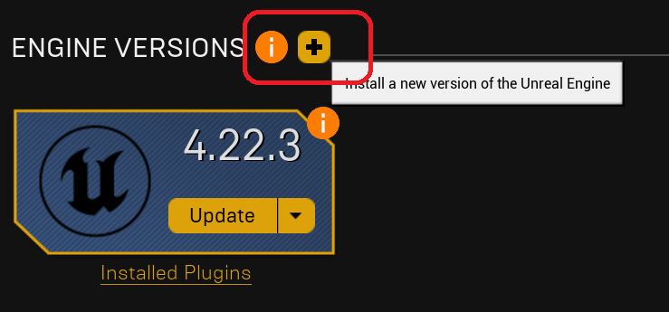
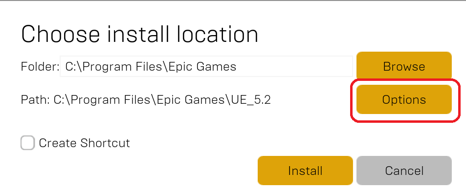
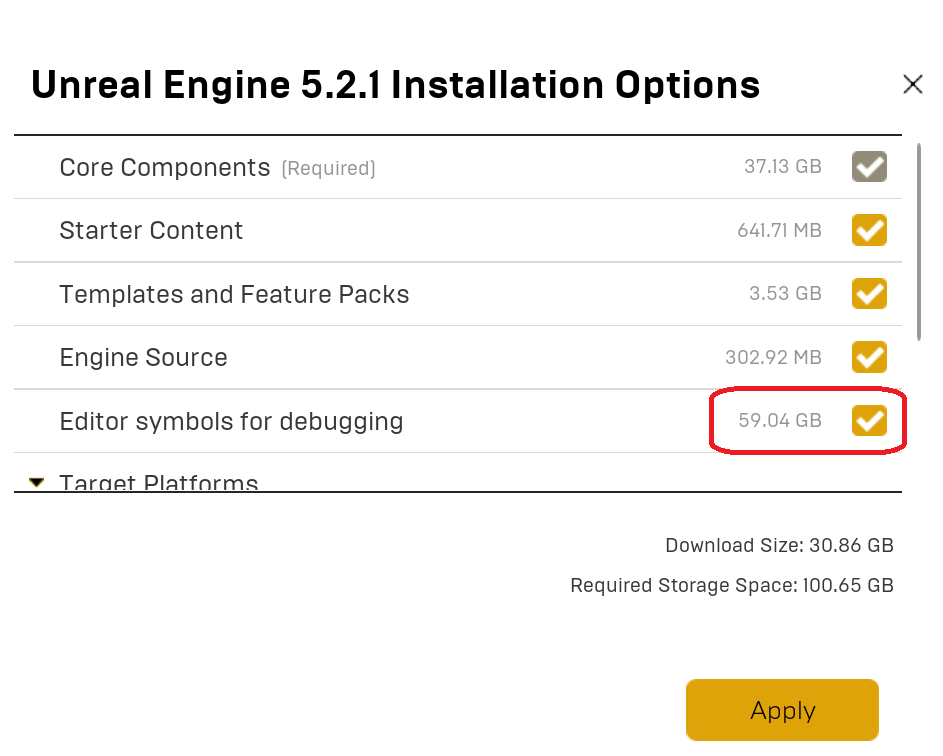

# Running Unreal

For a professional project, it's strongly recommended to build Unreal Engine from source so that you can make any changes to the engine as needed, and can support console platforms. However, for our purposes it simplifies and shortens the process to use an installed official build of Unreal rather than building from source.

## Installing Unreal

Your VM already has the Epic Games Launcher installed, but not the necessary version of Unreal Engine (5.2.1). Open the Epic Games Launcher and sign in (you can either use/make an Epic Games account, or use one of the many other sign-in options).

1. In the launcher, go to the Unreal Engine>Library section and click the "+" button next to engine versions:
   
2. It should automatically add the latest version, which is 5.2.1. If you get a different version click the dropdown next to the version. Then click the "Install" button:
   
3. In this dialog, click "Options" to bring up the install options:
   
4. In the install options:
   1. Make sure you check "Editor symbols for debugging":
      
   2. Make sure you *uncheck* all of the extra target platforms (you can always add them later if you decide you want to target them):
      
5. It may take around 30 minutes to download, verify, and finish the install

## Launch Visual Studio for the First Time

You should launch Visual Studio 2022 once on the VM before launching Unreal so that you can configure it:

1. Find Visual Studio 2022 in the start menu, and run it
2. It will ask you to login to a Microsoft account. You can do that if you want to, or otherwise just skip the login part
3. When it asks you for your preferences:
   1. For Development Settings, it's strongly recommended you select C++
   2. For the color theme, you can choose whichever you like, but I go with Dark
4. Once Visual Studio is open, go to Tools>Options... and find "Debugging" and ".NET/C++ Hot Reload" and uncheck the first two checkboxes (we don't need this feature because Unreal has its own "live coding" feature):
   

## Launching Unreal

Once the install completes, follow these steps to launch Unreal Engine:

1. Click the "Launch" button under Unreal 5.2.1 on the Library tab:
   
3. It will first install some prerequisites. After a minute or two, you'll notice the button will say "Launch" again, but just be patient and it will launch Unreal without you clicking again.
5. It will take another minute to load before you see the "Unreal Project Browser."

 In the Project Browser, you want to:

1. Select the "Top Down" template
2. Under Project Defaults:
   1. Select C++
   2. Uncheck "Starter Content"
   3. Make sure "Raytracing" is unchecked if it's not already
3. Set the Project Location to `C:\Work\`
4. Set the Project Name to `TopDown`

The settings should look like this:

{: .warn }
Before clicking Create, please double-check and confirm that your settings are correct.

1. Once you've confirmed your settings, click "Create"
2. You'll see a progress bar and then when it gets to the end, it will seem like it's frozen, but this is because it actually compiling the game project for the first time
3. After a minute or two, it will open both the Unreal Editor and Visual Studio. Go ahead and close both for now.

## Running TopDown from Visual Studio

1. In Windows Explorer, browse to `C:\Work\TopDown`. You should see a `TopDown.sln` (Visual Studio Solution file) and a `TopDown.uproject` (which is an Unreal project file):
2. Double-click on `TopDown.sln` and open the solution in Visual Studio.
3. In the Solution Explorer, notice that there is both an Engine>UE5 and a Games>TopDown project. The TopDown project should be bolded to denote it's the startup project. If it's not bold, right click on the TopDown project and select "Set as Startup Project." It should look like this:
   
4. To allow easier debugging of your game's code, on the toolbar at the top, change the build configuration from "Development Editor" to "DebugGame Editor":

   
5. In the Solution Explorer, right click on "TopDown" and select "Build":

   
6. You'll see the build log show up and after about a minute, the build will finish.
7. Click the green "Play" button on the top toolbar:

   
8. After a moment, the Unreal editor will load.

## Navigating the Editor

Loading into the editor will look something like this:

Take a moment to practice navigating in the editor. Here are the basics:

- You can left-click to select actors in the editor viewport. When selected, you will see details of that actors and any components in on the Details panel to the right
- The World Outliner in the top right allows you to pick and search objects by their names, as well as organize them
- If you hold down the right mouse button, you can move the mouse to rotate the camera and use WASD to pan the camera
- You can also play the top down template in editor. Click the green "Play" button on the top toolbar of the Unreal editor and try it out! Use left mouse click to click where you want the mannequin character to move. When you've had your fill, press **ESC** to exit the "Play-in-Editor" (or "PIE") session.

{:.note}
You can read more about the default interface in Unreal [here](https://docs.unrealengine.com/5.0/en-US/unreal-editor-interface/).

Once you've had your fill, close the Unreal Editor. Once the editor closes, also exit out of Visual Studio. You're now ready to [Commit to Perforce](00-04.html).
