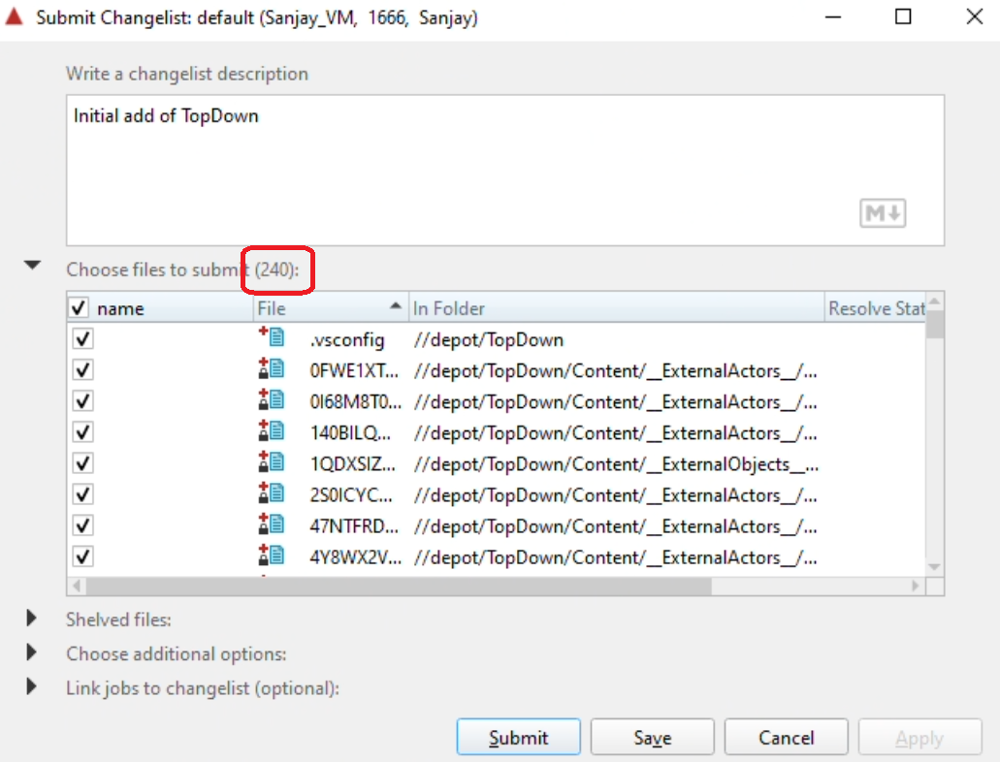

# Committing to Perforce

Now we will finish configuring the Perforce server, and then commit the TopDown files to Perforce.

## Perforce Type Map

The type map tells Perforce which files are binary and which files are text. It says which files should always be writeable locally or which files should be read-only unless checked out. It also tells Perforce how many previous revisions it should keep for files by default, which is a way to save space. In short, a correct typemap is really important for maintaining a Perforce server!

Back in the P4V client:

1. Go to "Connection>Environment Settings" and click OK

2. In the Windows start menu, type "cmd" and hit enter, which will bring up a command prompt. In the command prompt, enter the following command:
   ```
   p4 typemap
   ```

3. This will open up Notepad. Replace the contents of the file with the following:
   ```
   # Perforce File Type Mapping Specifications.
   #
   #  TypeMap:	a list of filetype mappings; one per line.
   #		Each line has two elements:
   #
   #  		Filetype: The filetype to use on 'p4 add'.
   #
   #  		Path:     File pattern which will use this filetype.
   #
   # See 'p4 help typemap' for more information.
   
   TypeMap:
   	binary+S2w //depot/....exe
   	binary+S2w //depot/....dll
   	binary+S2w //depot/....lib
   	binary+S2w //depot/....app
   	binary+S2w //depot/....dylib
   	binary+S2w //depot/....stub
   	binary+S2w //depot/....ipa
   	binary //depot/....bmp
   	text //depot/....ini
   	text //depot/....config
   	text //depot/....cpp
   	text //depot/....h
   	text //depot/....c
   	text //depot/....cs
   	text //depot/....m
   	text //depot/....mm
   	text //depot/....py
   	binary+S3l //depot/....uasset
   	binary+S3l //depot/....umap
   	binary+S3l //depot/....upk
   	binary+S3l //depot/....udk
   	binary+S3l //depot/....ubulk
   	text+w //depot/....deps.json
   	text+w //depot/....runtimeconfig.json
   	text+w //depot/....runtimeconfig.dev.json
   	text+w //depot/....dll.config
   	text+w //depot/...UnrealBuildTool.xml
   	text+w //depot/....csproj.References
   	text+w //depot/....modules
   	text+w //depot/....target
   	text+w //depot/....version
   ```

4. Save the file and then close Notepad.

5. You should notice that the command prompt says `Typemap saved.`

{: .note }
In the provided typemap, the Unreal asset types (uasset, umap, etc.) are set to `binary+S3l`. This means our server is only going to save the prior 3 revisions of each of those files, which will save a significant amount of space if we keep changing them. However, for a real project you likely would want to use `binary+l` to be sure to preserve the whole history (or at least something like `S10l` to have a longer history).

## Creating the Ignore File

Like in Git, Perforce supports an ignore file. However, annoyingly this ignore file is set *per workspace* rather than per server. To create and tell Perforce to use the ignore file, do the following:

1. Open up Notepad (which gives you a new empty file)

2. Copy and paste the following contents into the empty file:
   ```
   Saved/
   Intermediate/
   DerivedDataCache/
   *.pdb
   obj/
   *.vcxproj
   *.sln
   *-Debug.*
   FileOpenOrder/
   .vs/*
   ```

3. Go to "File>Save As...". In the dialog box, browse to This PC>C:>Work. Change the "Save as type" to "All Files" and type in `.p4ignore` as the file name:
   

4. Click "Save" to create the file.

5. Confirm in Windows Explorer under `C:\Work` you see a `.p4ignore` file of type "P4IGNORE File":

6. Back in a command prompt, change the directory to `C:\Work` with:
   ```
   cd C:\Work
   ```

7. Then tell Perforce to use the ignore file with:
   ```
   p4 set P4IGNORE=.p4ignore
   ```

8. If it worked, you won't see any messages output

9. You can now close the command prompt

## Submitting the .p4ignore

Whenever you create new files that you want to be in Perforce source control, you need to add it. You can do this from the P4V client among other ways. Back in P4V:

1. Under the Workspace tab you should see that it shows there's a `.p4ignore` file in `c:\Work`. Right click on it and say "Mark for Add...":
   
2. Click OK to add it to the default pending changelist
3. Click on the "Pending" tab to the right (if this isn't visible, select "View>Pending Changelists" from the P4V menu)
4. In the Pending tab, right click on the default changelist and select "Submit...":
   
5. Perforce requires you to include a message in a submitted changelist. Type in something useful like "Added p4ignore", and then click Submit:
   
6. You'll see a message in the Log part of the P4V window saying that it submitted the change

## Testing the .p4ignore

Before we check in anything to Perforce, we should confirm our p4 ignore is working properly so that we don't submit lots of intermediate/temporary files.

1. In the Workspace view, browse to `C:\Work\TopDown\Saved`, right click on the Saved folder, and say "Reconcile offline work...":
   
2. If the ignore file is working properly, you should get a message that there are no files to reconcile:

   
3. If this worked, your P4 ignore is correct and you can submit!

{:.danger}
Please make sure you get the message that there's nothing to reconcile before moving onto the next step.

## Submitting TopDown to Perforce

Now that Perforce is setup, it's time to add our initial TopDown project files to Perforce.

1. Right click on the `c:\Work` and select "Mark for Add...":

   
2. Click OK to select the default changelist
3. You'll see a dialog box saying that some files were ignored. Check the "Do not warn" checkbox and then click OK:
   
4. Right click on the default changelist and select "Submit..."
5. Make sure that it shows ~240 files to submit (if the number is significantly higher than this, something is wrong):

   
6. Type in a useful message and submit the changelist

You're done with the required setup! If you'd like to also setup your local machine for development, you can continue on to [(Optional) Setting Up a Local Machine](00-05.html). Otherwise, you're done with your setup and should shut down your VM!
