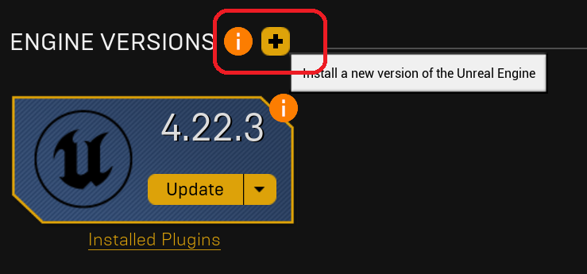
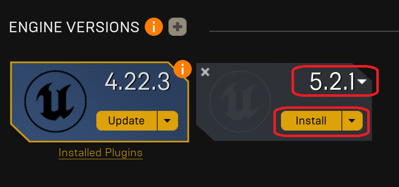
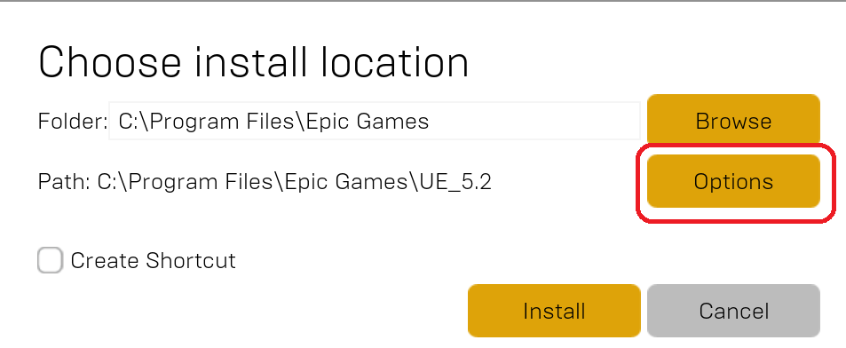
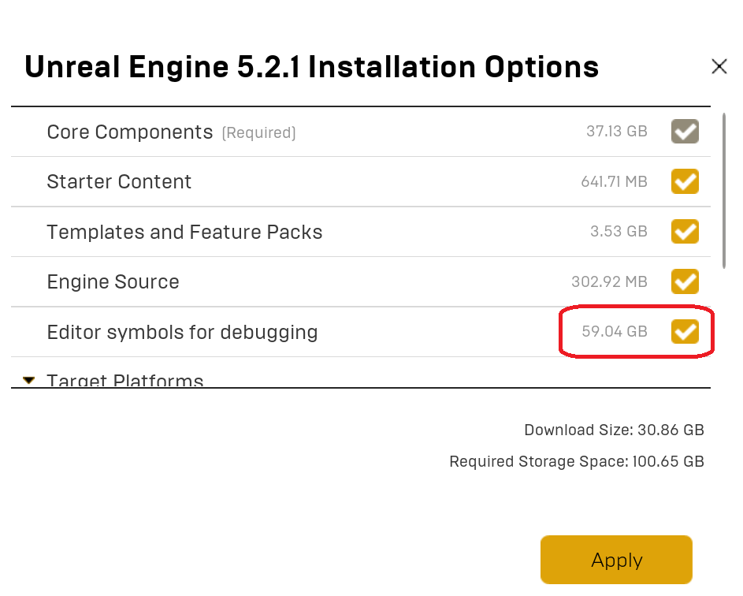
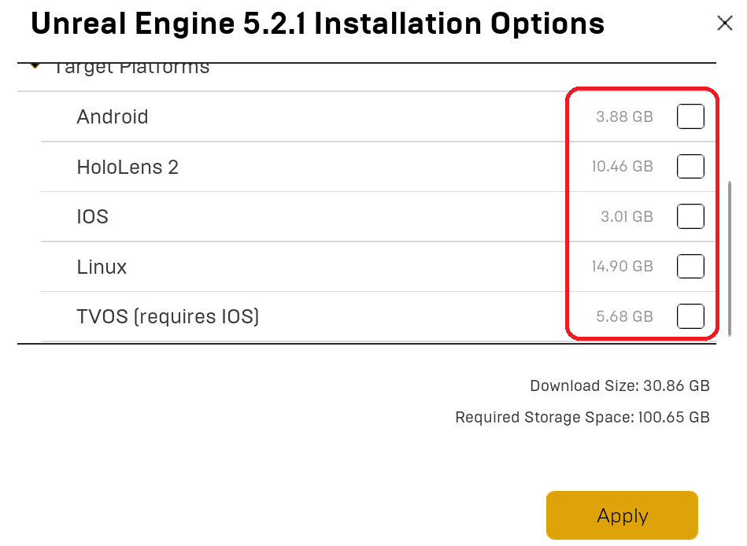
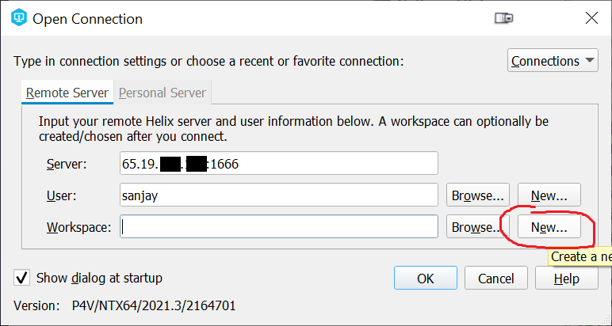

# (Optional) Setting Up a Local Machine

Keep in mind that Unreal 5 requires a fairly powerful machine for development. As mentioned before, the minimum specs are roughly:

- Windows 10 (although the editor does run on Mac and Linux as well, I don't recommend it)
- 8-core CPU
- 32 GB of system RAM
- Nvidia GTX 1080 or AMD RX Vega 64 w/ 8GB of VRAM
- 250+ GB free space on an SSD

If your machine doesn't meet these specs, it probably is not worth setting up your local machine, and instead you should just stick to using your VM, which you've already setup!

## Requesting a Static IP

To be able to connect to your VM's Perforce server remotely, you need a Static IP address. To get one assigned to your VM, please post on the corresponding Piazza thread to request one.

Once you have a Static IP, I will tell you what it is.

## Local: Install Visual Studio 2022

You need to install [Visual Studio 2022](https://visualstudio.microsoft.com/downloads/) (community edition is fine). You need to install the following workloads:

- Desktop Development with C++
- Game Development with C++
- .NET desktop development
- Universal Windows Platform development

Additionally, under "Individual components" select the following components:

* .NET Core 3.1 Runtime (Out of support)
* .NET Framework 4.6.2 targeting pack
* MSVC v143 - VS 2022 C++ x64/x86 build tools (v14.34-17.4)

If you've previously installed Visual Studio 2022, you can go into the installer and "Modify" to add any workflows you're missing.

{: .note }
You may wonder why you need .NET/C# workflows. The reason is a decent amount of the support tooling for Unreal is written in C#, and so you typically need these workflows for everything to build properly.

## Local: Install P4V

You also need to install [P4V](https://www.perforce.com/downloads/helix-visual-client-p4v) locally. You can leave everything on the default settings.

## Local: Install Unreal Engine

You will need to install the Epic Games Launcher and then Unreal Engine through that.

1. If you don't already have the Epic Games Launcher, you can download it from [here](https://launcher-public-service-prod06.ol.epicgames.com/launcher/api/installer/download/EpicGamesLauncherInstaller.msi?productName=unrealEngine).
2. Open the launcher and login.
3. In the launcher, go to the Unreal Engine>Library section and click the "+" button next to engine versions:
   
4. It should automatically add the latest version, which is 5.2.1. If you get a different version click the dropdown next to the version. Then click the "Install" button:
   
5. In this dialog, click "Options" to bring up the install options:
   
6. In the install options:
   1. Make sure you check "Editor symbols for debugging":
      
   2. Make sure you *uncheck* all of the extra target platforms (you can always add them later if you decide you want to target them):
      
7. It will take quite some time to download, verify, and finish the install

## Local: Syncing to Perforce

1. Run P4V locally
2. On the "Open Connection" dialog, for Server put `XXX.XXX.XXX.XXX:1666`, where the `X`s are your public IP address. For User put the username you created on your Perforce server. And then click the "New" button for the Workspace:
   
3. I'll ask for your password, which is the one you setup earlier on the server
4. For the workspace root, use wherever you'd like (but a short path is best)
5. On the "Advanced" tab, enable Modtime, Rmdir, and On submit "Revert unchanged files" like before
6. Then click OK to create the new workspace
7. In the workspace view, right click on your root directory and say "Get Latest Revision":
   
8. Assuming you have a solid connection, the sync will finish quickly. Confirm that the files are on your local machine in your Workspace directory
9. Now you need to tell Perforce to use your `.p4ignore` (as it's enforced per workspace)
10. Open a command prompt and navigate to your workspace root
11. Run: `p4 set P4IGNORE=.p4ignore`
12. Now close P4V

## Local: Running TopDown

We now need to build and run TopDown locally.

1. In Windows explorer, browse to your perforce root and find the TopDown folder. In this folder, right click on the TopDown.uproject and select "Generate Visual Studio project files":
2. After a moment, it should create a TopDown.sln file. Open that in Visual Studio
3. As before, make sure your startup project is "TopDown" and your configuration is set to "DebugGame Editor" (check the instructions [back here](00-03.html#running-topdown-from-visual-studio) if you don't remember how)
4. Click the Play button to build and launch the editor.
5. You'll want to setup the revision control settings like you did in Lab 1, to connect Unreal to Perforce

Occasionally, you may have to work offline from Perforce. In this case, one of the issues you'll run into is that many files will be marked as read-only and you will not be able to "check out" the files from Perforce to make them writable. In this case, what you can do is mark the files as writable locally, and then when you're able to connect to Perforce again, you can reconcile offline work as demonstrated in the Week 1 flipped classroom video.

## Developing Both Locally and on the VM

If you plan on using both the VM and a local machine, you'll want to always commit your changes when you're done on one machine so that you can always sync to the latest version on either machine. It's also good to get the habit of regenerating the Visual Studio project file every time you sync, as that'll make sure any new source files get added to Visual Studio (although the code will still compile even if you don't do this).

