# (Optional) Using Rider

Rider is a relatively new IDE from JetBrains which, among other things, supports [developing for Unreal Engine](https://www.jetbrains.com/lp/rider-unreal/).

If you're interested in trying out Rider, this page first outlines my comparison of Rider versus Visual Studio, and then goes over how to setup, configure, and use Rider.

## Comparing Rider to the Alternatives

Many Unreal C++ developers on Windows use either base Visual Studio or Visual Studio plus the [Visual Assist](https://www.wholetomato.com/) plugin (VAX). Here's my unscientific comparison of Rider to the competitors:

|                                              |    Visual Studio 2022    |       Visual Studio 2022 + VAX        |                 Rider                 | Notes                                                        |
| -------------------------------------------- | :----------------------: | :-----------------------------------: | :-----------------------------------: | ------------------------------------------------------------ |
| **Initial Parse Time**                       |       1-2 minutes        |        1-2 minutes<sup>1</sup>        |               <1 minute               | Defined as how long it takes before the IDE can give reasonable autocomplete and syntax highlighting.<br /><br /><sup>1</sup>Visual assist has some basic functionality almost instantly, but you need to wait for the full Intellisense parse to complete for all the features. |
| **Autocomplete**                             |            ⭐             |                  ⭐⭐                   |                  ⭐⭐⭐                  | Base Visual Studio autocomplete sometimes fails spectacularly with Unreal. VAX is usually very good but occasionally gets confused because it does use Intellisense for more complete data. Rider is really impressive here, especially when autocompleting for function overrides and delegates. |
| **Go to File**                               |            ⭐⭐            |                  ⭐⭐⭐                  |                  ⭐⭐                   | Both base Visual Studio and Rider have good "go to file" functionality, but VAX is still slightly better in my book. |
| **Go to Definition**                         |            ⭐             |                  ⭐⭐                   |                  ⭐⭐⭐                  | Base Visual Studio sometimes takes forever and fails in Unreal code. VAX is usually very good but still sometimes jumps to the wrong definition (like a forward declaration). Rider seems to be *slightly* better in my testing. |
| **Go to Symbol**                             |            ⭐             |                  ⭐⭐⭐                  |                  ⭐⭐⭐                  | Both Rider and VAX do well with jumping to a symbol, while base Visual Studio fails maybe a third of the time. |
| **Generate Implementations**                 |            ⭐⭐            |                  ⭐⭐                   |                  ⭐⭐⭐                  | Both Visual Studio and VAX are good at generating stub implementations of functions. Rider seems better because it can generate multiple definitions at once (if you've added several declarations), and it automatically adds `Super` calls when overriding a parent class function. |
| **`UPROPERTY`/`UFUNCTION` Autocomplete**     |            ❌             |                   ✅                   |                   ✅                   | Both VAX and Rider can autocomplete `UPROPERTY`/`UFUNCTION` properties like `EditDefaultsOnly`. |
| **Understands RPC/Native `_Implementation`** |            ❌             |                   ✅                   |                   ✅                   | Both VAX and Rider understand when a native `UFUNCTION` needs an `_Implementation` |
| **Has Blueprint Plugin**                     |      ✅<sup>2</sup>       |             ✅<sup>2</sup>             |             ✅<sup>3</sup>             | Blueprint plugins allow you to see for example which blueprints inherit or use your C++ code, and also some additional features like having formatted Unreal Logs in the IDE.<br/><br/><sup>2</sup>Visual studio added IDE support and [this plugin](https://www.unrealengine.com/marketplace/en-US/product/visual-studio-integration-tool).<br/><br/><sup>3</sup>Rider has a RiderLink plugin it'll ask install the first time you open a project. |
| **Debugger**                                 |           ⭐⭐⭐            |                  ⭐⭐⭐                  |                   ⭐                   | Rider's debugger is fine for simple debugging, but I think Visual Studio is still best-in class here by a significant margin. |
| **Mac Version**                              |      ❌<sup>4</sup>       |                   ❌                   |                   ✅                   | <sup>4</sup>While there is a Mac version of "Visual Studio for Mac," it does not support C++ nor Unreal Engine. |
| **Linux Version**                            |            ❌             |                   ❌                   |                   ✅                   |                                                              |
| **Console Debugging Support**                |            ✅             |                   ✅                   |                   ❌                   | Rider currently does not support debugging for Sony, Microsoft, or Nintendo consoles. |
| **Price (for students)**                     |           Free           |               $129/year               |      Free for 1 year<sup>5</sup>      | <sup>5</sup>Can be renewed yearly if still a student.        |
| **Price (commercial)**                       | Free or $499<sup>6</sup> | VS cost + $279 first year<sup>7</sup> | VS cost + $149 first year<sup>7</sup> | <sup>6</sup>Community edition is allowed for commercial use for up to 5 users for companies with less than $1 million in annual revenue.<br/><br/><sup>7</sup>Both VAX and Rider require Visual Studio for Unreal Development. They also have a pricing model where renewing is cheaper than the first year. |

Going through all that, my general sentiment right now is:

* If you do not have Visual Assist, you should strongly consider using Rider instead of Visual Studio for primary development.
* If you do have Visual Assist, it's a bit more complicated. I think if you're generally happy with your workflow and/or console debugging is important to you, it may make sense to stick with what you have. But I would still at least look at Rider.
* If you're on Mac, I would unequivocally use Rider over Xcode (which is extremely frustrating to use with Unreal).

Anecdotally, I've spoken to several professional Unreal developers about Rider. Some swear by Rider now and never want to go back to Visual Studio. Others mostly use Rider but still use Visual Studio for debugging and/or console development. Others tried Rider but decided not to switch. And many haven't tried it yet or are skeptical if it's worth the time to go through with the switch.

For me, personally, I could see myself largely using Rider for Unreal development but still using Visual Studio + VAX when I have a more difficult problem to debug, or I'm debugging on consoles. However, as I've just started using Rider recently, I still haven't made a decision.

## Setting Up Rider

If you decided you want to try Rider, here are the minimal steps you need to follow...

### Prerequisites

Rider still builds your C++ code with Unreal Build Tool, which in turn uses whatever the platform toolchain is. In the case of Windows, Unreal uses MSVC to build by default. Thus, you will still need to install the required Visual Studio 2022 components first (as noted [here](00-05.html#local-install-visual-studio-2022)). Of course, you also will need Unreal (either from the launcher or the full source).

### Getting a License for Rider

As a student, you can get a [free yearly license](https://www.jetbrains.com/community/education/#students) for all JetBrains products including Rider. If you aren't a student (or after you graduate), there is a 30-day trial of Rider but after that you'll have to pay.

### Download and Installing Rider

You can download rider [here](https://www.jetbrains.com/rider/download/). Then run the installer and it'll launch. It will ask you to login with your JetBrains account to validate the license.

### Updating your .p4ignore

You should update your `.p4ignore` with the following additional line, as Rider will create several IDE files in the `.idea` directory which you don't want to commit to Perforce:

```
.idea/*
```

### Opening the .uproject

Once Rider loads up, you'll want to open the .uproject file for the Unreal project you want to open. (Although Rider can also open a Visual Studio solution file, they strongly recommend you just open the .uproject directly).

The first time you load up a specific Unreal project it will take a little bit of time to cache everything, and then you will see a pop-up in the bottom right corner asking you to install the RiderLink plugin, which is what it uses to communicate with Unreal. Installing to the Engine is recommended. You will need to restart Rider for the plugin.

### Disabling Machine Learning Plugin

There is a "Machine Learning in Search Everywhere" plugin which is enabled by default. However, as of writing this page, there is a bug in the plugin that breaks "go to file" pretty spectacularly. For this reason, you should disable it.

Bring up the settings (either go to the menu, or the shortcut is Ctrl+Alt+S). Then under plugins find the offending plugin and disable it:

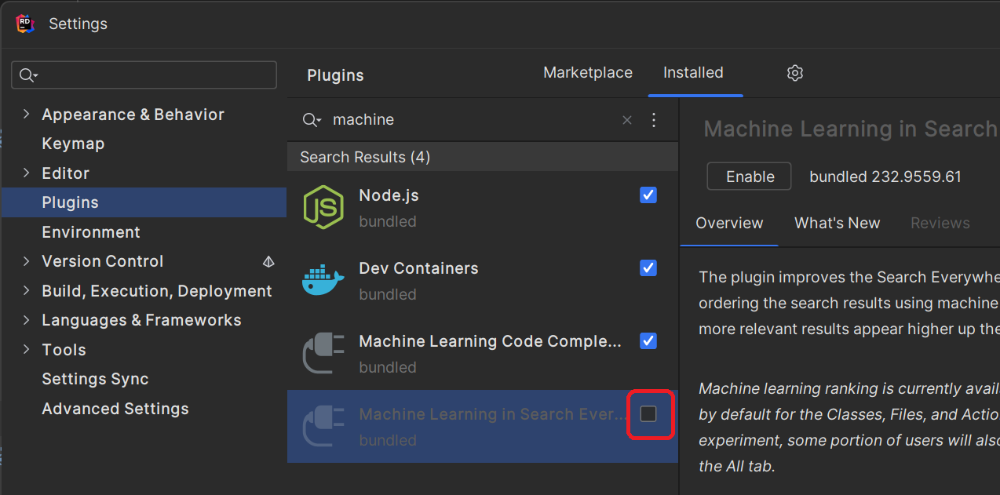

You'll need to restart Rider for this change to take, as well.

### Selecting Build Configuration

You can change your build configuration on the top toolbar towards the right. I would recommend DebugGame Editor for our class:

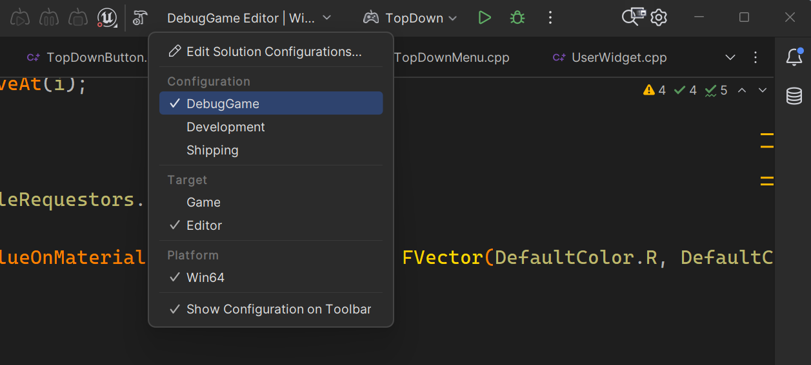

### Launching Unreal

You should usually launch with the bug button and ***NOT*** the play button so that you start with the debugger attached:

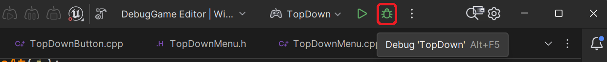

### Telling Unreal you want to use Rider

Once in Unreal, go to the Editor Preferences (not project settings). In here, there are two things you need to change.

Under General>Source Code, change the "Source Code Editor" to "Rider Uproject":

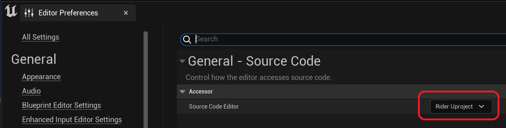

Next, under the General>Live Coding settings, you need to disable "Automatically Compile Newly Added C++ Classes":

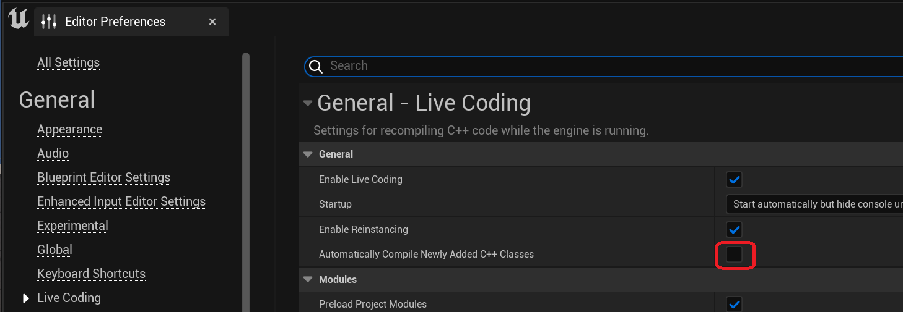

You have to disable automatic compilation of new classes because if this option is enabled, when you create new classes in Unreal, it launches a live code build at the same time that Rider tries to refresh the project. This fails to refresh the project and then you have to reload Rider. However, you can still manually trigger the live code after adding new files (and in any event, I prefer that).

### Setting Up Perforce in Rider

While you don't have to setup Perforce in Rider, it's convenient to do so. First, make sure Rider is closed. Then, open P4V and connect to the server. In P4V select Connection>Environment Settings and click OK to set the environment variables.

{:.note}
You can also manually configure Rider by typing in the various Perforce settings, but I find it easier to just use the environment variables.

Then reopen Rider and your uproject. In Rider's settings, find Version Control>Directory Mappings and add a Directory Mapping for your Perforce workspace root, selecting "Perforce" as the VCS:

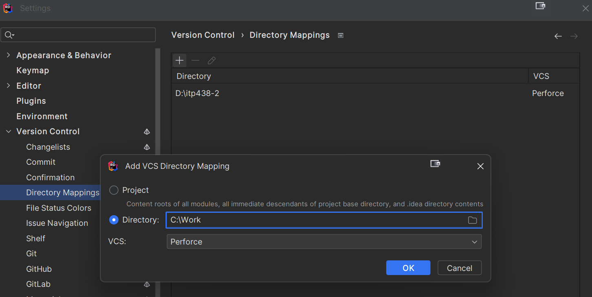

Now whenever you open a writeable file in the project for edit, Rider will ask you if you want to check it out with version control. You can check the box in this dialog so it stops asking you and just automatically checks out files whenever you start editing them.

Once connected you will also have a dropdown that lets you sync to Perforce or submit change lists:

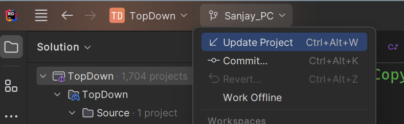

## Customizing Rider

While Rider will work out of the box once you finish the above setup, there are some configuration changes I made to better support my preferences and workflow. These changes are largely optional but I would suggest trying them out.

The changes are all made in the Settings dialog box, which you can bring up from the menu or by pressing Ctrl+Alt+S (on Windows, at least).

### Color Scheme and Font

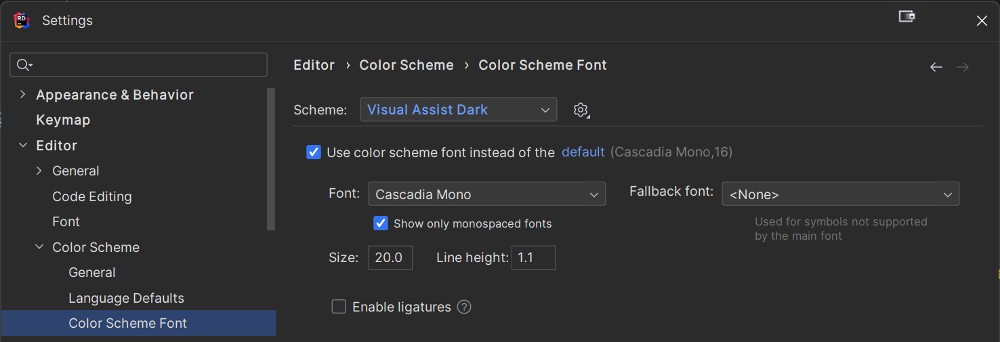

I set my color scheme to "Visual Assist Dark" because I'm used to that color scheme from my years of Visual Studio + VAX use. I also made sure the font set to the Cascadia Mono (which is the default Visual Studio 2022 font, and I like it better than the default Rider one), and I set the font size to 20 (I have a 4K monitor) and the line width to 1.1 (because the default of 1.2 seemed too big of a gap).

### Keymap

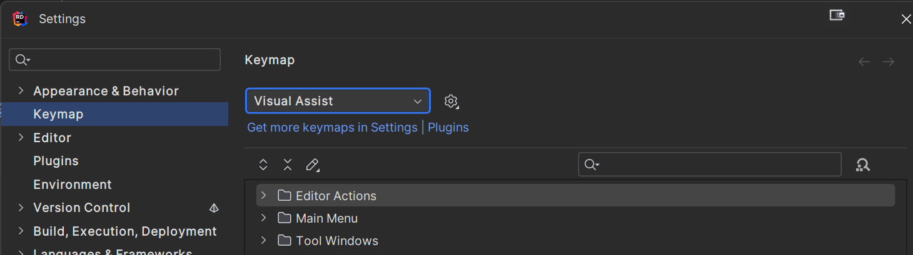

I selected the "Visual Assist" keymap because, again, I'm used to it, and I also like how it doesn't require using function keys for common features.

However, I would suggest changing the binding for "Generate" from the default of Alt+Insert, because especially on laptops the insert key may not be easy to hit. Instead, I mapped "Generate" to Alt+. instead (this is mapped to "show menu" by default, but I don't think I need that key mapping.)

For this setup, here are the main hotkeys you'll use:

| Hotkey      | Description                                                  |
| ----------- | ------------------------------------------------------------ |
| Alt+G       | "Go to definition" - When highlighting a identifier, will go to the definition. If already at the definition, will go to the declaration. |
| Alt+O       | Switch between the .h and .cpp file                          |
| Alt+Shift+O | "Go to file" - Lets you type in a partial file name and can select and open a file |
| Alt+Shift+S | "Go to symbol" - Lets you type in a partial symbol and can select and go to the definition of a symbol |
| Alt+.       | "Generate" - Allows you to do things like generate stub implementations given definitions |
| Ctrl+Alt+/  | Comment one or more lines with `//` (you can use Ctrl+Shift+/ if you want multiline block comments with `/* */`) |

### Disabling Inlay Hints

By default, Rider will show inlay hints for things like names of parameters. It looks like this:

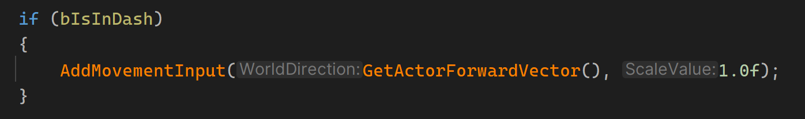

Personally, I find inlay hints add noise and I do not like having text which is not the source code inline with the source code. So, I went into the Inlay Hints>C++ section of the settings and set each one to "Disable Always" (there are several subsections to go through):

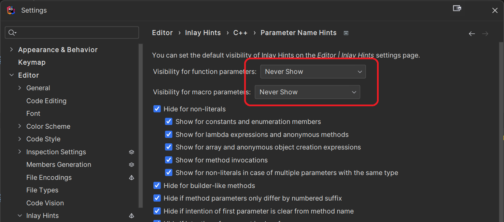

### Disabling Code Folding

Code folding adds arrows to the column of the editor so you can collapse certain sections like the include sections or certain functions, etc. While some people like this, I personally do not. So, I went in and turned off automatic code folding and also disabled the code folding arrows:

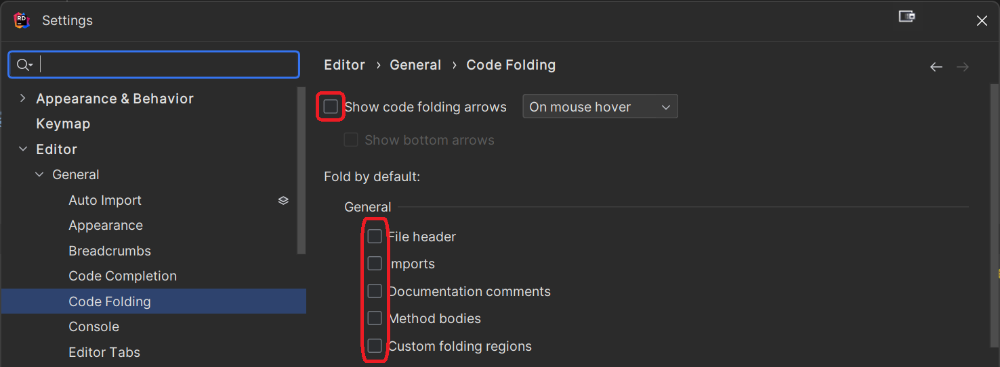

## Workflow Tips

Finally, here are some tips you may find helpful when using Rider to speed up your Unreal development. For this part, when referencing hotkeys, I assume you are using the [keymap I selected](00-06.html#keymap). If you aren't, then you will have different hotkeys.

### Adding Overrides of Functions

Suppose you have a `UUserWidget` subclass that you want to add an override of `NativeTick` to. Rider makes this easy to do quickly:

1. Type enough of the function name `NativeTick` so that it shows it in the autocomplete dropdown:
   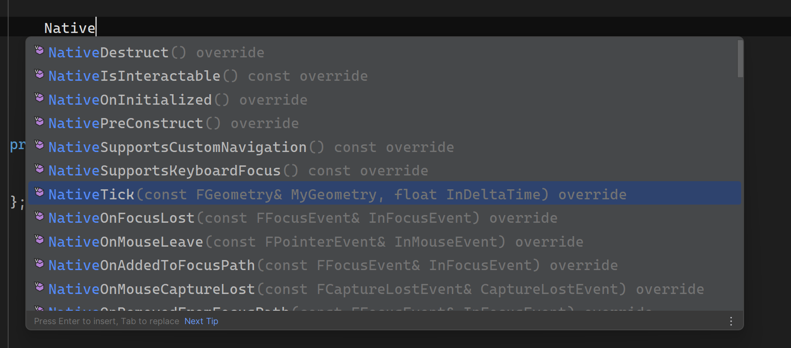
2. With the function you want highlighted (you can use the arrow keys to select if you need to), press either Tab or Enter, which will complete the definition including the parameters, virtual, and override:
   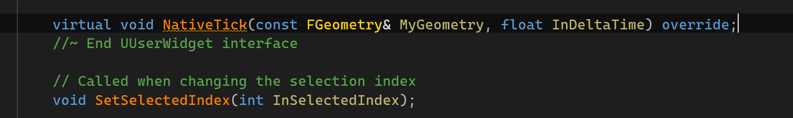
3. Next, press Alt+. to bring up the "Generate" dialog, and select "Definitions":
   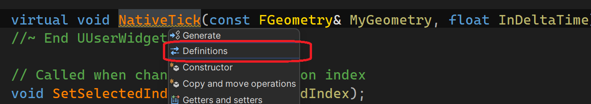
4. You now will have a stub implementation in the .cpp including the `Super` call:
   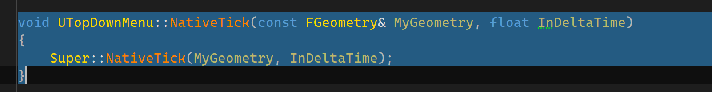

{:.note}
You can create several definitions at once, and then the "Definitions" dialog will show you a list of all the definitions and you can select all to generate all the stubs at once.

### Go to File

The "go to file" feature (Alt+Shift+O) allows you to jump to a source file by typing in letters in the file name. It will show you a list of all source files which match the string:

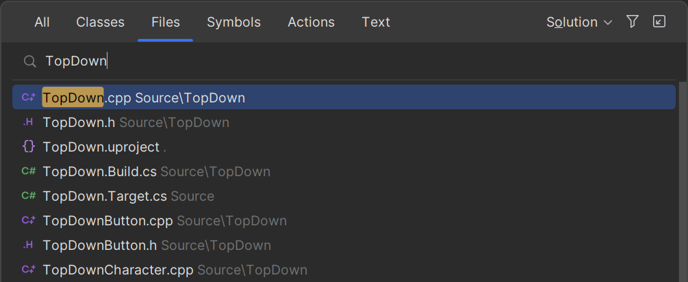

For common words like "Character" you probably will want to type in more than that to find the specific file.

### Go to Symbol

Similarly, "go to symbol" (Alt+Shift+S) lets you find a symbol in the code (such as class name, function, etc.) and jump to it:

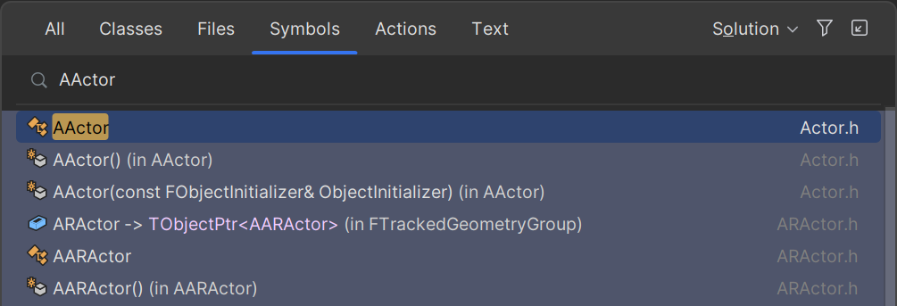

### Automatic Header Includes

One nice feature of Rider is it will automatically add includes of relevant headers if you reference the class in your code. This works for both Unreal types and your game-specific types. For example, if you type out a pointer like `ATopDownCharacter*` in your code, Rider will automatically add an include of `TopDownCharacter.h`.

### Showing Potentially Unused Headers

If your file has headers which appear to be unused by the source, they will be greyed out:

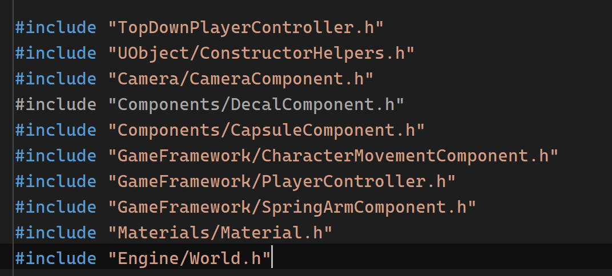

It will also generate a warning in the problem list as something worth looking at.

### Using the Debugger

If you launch with the debugger attached (the bug symbol), you can use normal debugger functionality. As in most IDEs, you can click on the column next to the text to add a breakpoint (for Rider, you should click on the line number).

Keep in mind the normal caveat of Debug vs. Development builds in Unreal still applies. In a Development build, code may be optimized and breakpoints and other debug functionality will be spotty at times. However, if you need to debug Development code you can use the pragma tricks to disable optimization for specific functions.

When stopped at a breakpoint, the debug info is at the bottom of the window:

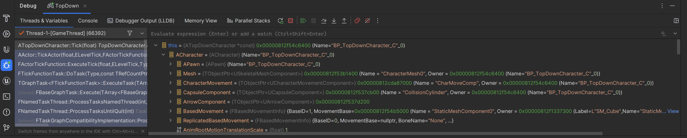

The callstack is to the left, variables to the right (including simplified visualization of Unreal's types), and the normal debug controls like continue, step over, step into, and step out are in the debug section.

You can set data breakpoints as well by right-clicking on a variable and choosing "Add Watchpoint":

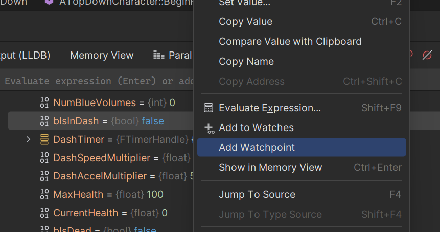

{:.warn}
In my testing, the data breakpoints in Rider are a little spotty and may be hit or miss. Also, it doesn't yell at you when you try to set a watchpoint for a value that it's not possible to do so (as you can only break on a 4 byte change).

To view all breakpoints and/or remove them, press Ctrl+Alt+B to bring up the breakpoint window which shows all of them:

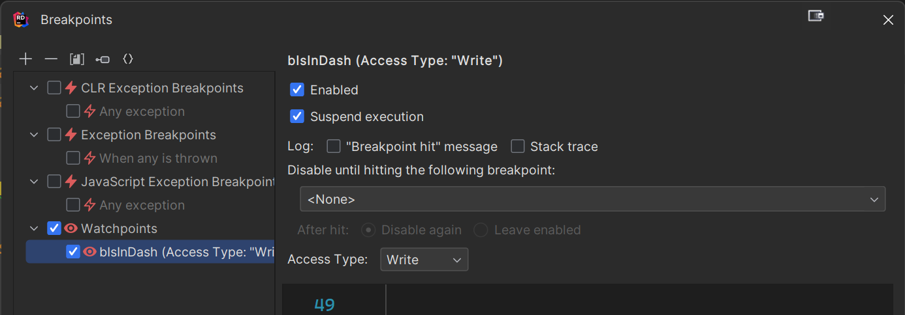
