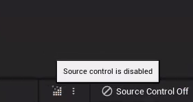
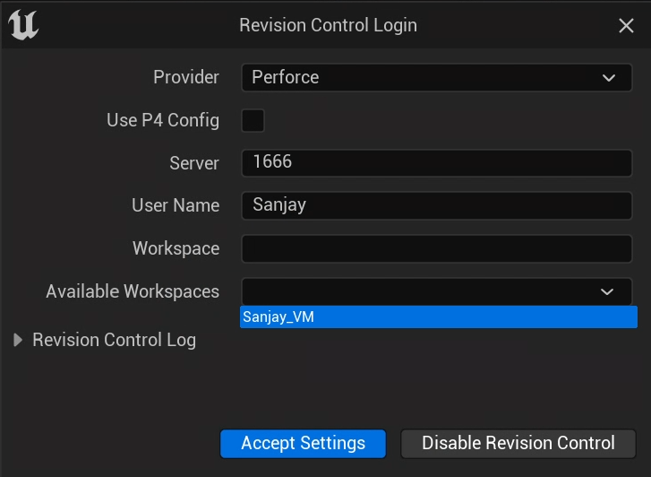
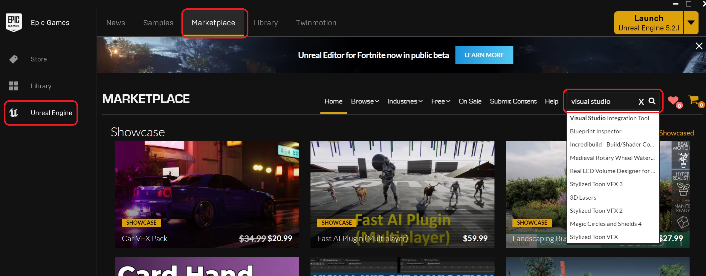
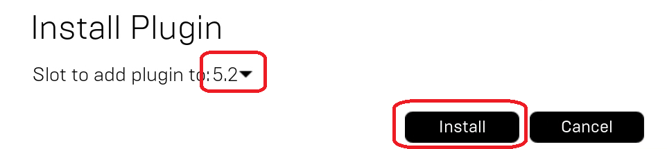

# Configuration

There are a few things we should configure in a new Unreal Project, so we'll do those first.

## Revision Control

If you're working on the VM, you can connect Unreal to Perforce to allow Unreal to automatically check out files that you've changed. (If you're working locally, you don't want to do this because the Perforce server will be offline most of the time).

1. If it's not already, open P4V and make sure you're logged into your Perforce account.
2. In the bottom right corner of the editor, click on the text that says "Revision Control" to bring up options, and select "Connect to Revision Control...":
3. In the Revision Control Login dialog, it should automatically fill in Perforce and the Server as well as User Name. Click the "Available Workspaces" dropdown and select your workspace. Then click "Accept Settings":
   
4. You should see a notification that the connection to source control was successful.

## Editor Preferences

Editor preferences are saved per machine, so you'll want to make these changes on any machine you're doing development on.

1. In the Unreal Editor's menu at the top, select Edit>Editor Preferences...
2. Type "hot reload" in the search box
3. Uncheck "Automatically Compile Newly Added C++ Classes" as I find it better to have control over when to recompile after adding new C++ classes (especially if you're adding several at once)
6. Close the Editor Preferences window

## Project Settings

Project settings end up being saved in either Config/DefaultGame.ini or Config/DefaultEngine.ini, depending on the settings you're changing. These will be synced in Perforce to everyone.

1. Go to Edit>Project Settings...
2. On the Project>Description page, change the Copyright Notice to the following format:
   
   `Copyright {Your Name} - {youremail}@usc.edu`
   
   For example my copyright notice was changed to:
   `Copyright Sanjay Madhav - madhav@usc.edu`
   
   This is mostly just so we can differentiate the code submissions easily.
3. Close the Project Settings window

## Committing Project Settings

In P4V, if you refresh the view you will now have this file checked out and in your default changelist:

```
TopDown/Config/DefaultGame.ini
```

Go ahead and submit the changelist.

## Installing Unreal Visual Studio Integration

Microsoft made a plugin to assist with doing Unreal development in Visual Studio. We'll install it and tell Unreal we want to use it.

1. Make sure both Unreal and Visual Studio are closed
2. From the Epic Games Launcher, go to the Unreal Marketplace and search for "visual studio":
   
3. On the page for the Visual Studio Integration Tool, click the "Free" button. It may ask you to accept a EULA, and then the "Free" button will change to "Install to Engine." Click the "Install to Engine" button and select Unreal 5.2 and click "Install":
   
4. Open the solution file in Visual Studio, and then hit play to start up Unreal
5. Select "Edit>Plugins..." in the menu
6. In the Plugins dialog box, search for "visual studio" and make sure the Visual Studio Integration Tools plugin is enabled
7. In P4V, you'll have the TopDown.uproject file checked out. Go ahead and commit it.
8. You'll have to close Unreal and relaunch again from Visual Studio for the change to persist

## Adding a .clang-format

A `.clang-format` file helps make sure that you're sticking with Unreal's coding standard (which is a criteria evaluated during code review). This type of file is recognized by Visual Studio and several other source code editors.

1. First, make sure Unreal and Visual Studio are closed
2. Open Notepad
3. Copy and paste the text from here into the file: [https://raw.githubusercontent.com/TensorWorks/UE-Clang-Format/main/.clang-format](https://raw.githubusercontent.com/TensorWorks/UE-Clang-Format/main/.clang-format)
4. "Save As" the file, and browse to your `C:\Work\TopDown` directory. Select "all files" as the type, and name the file `.clang-format`.
5. Next, install the following [Visual Studio extension](https://marketplace.visualstudio.com/items?itemName=mynkow.FormatdocumentonSave), which will make it so the `.clang-format` settings are applied to every file when you save it. (Alternatively, you can use CTRL+K, CTRL+D to reformat the file)
6. Now reopen your Visual Studio solution file. When you start editing code, Visual Studio will show a dialog saying it found a clang format that it's going to use, and you can check the box to not show it again.

{: .warn}
Although `.clang-format` will help make sure you stick to the coding convention, it won't catch everything.

Since you added the `.clang-format` file manually, you will need to go into P4V, right click on the `.clang-format` file is, and mark it for add. Then submit the change.

Now it's time to start writing code and [add a HUD class](01-02.html).
