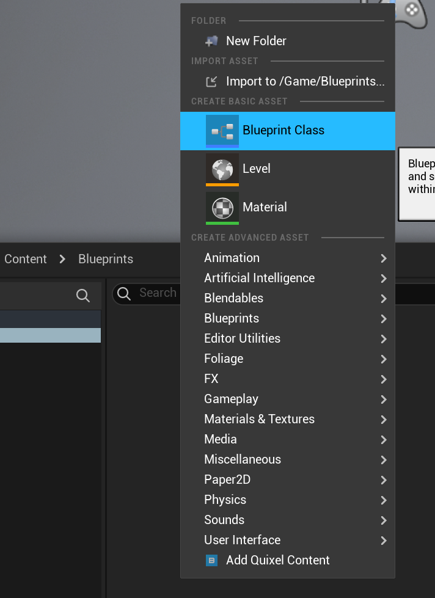
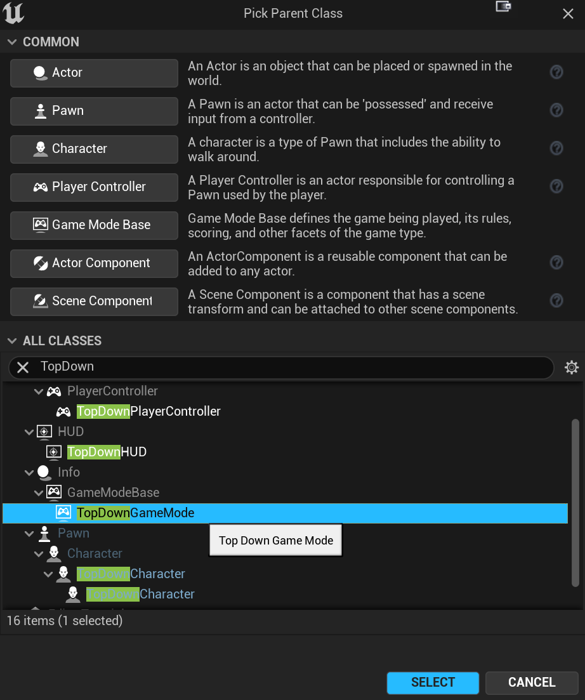
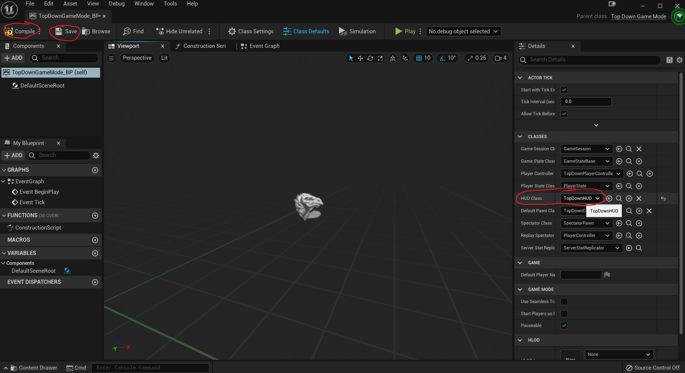
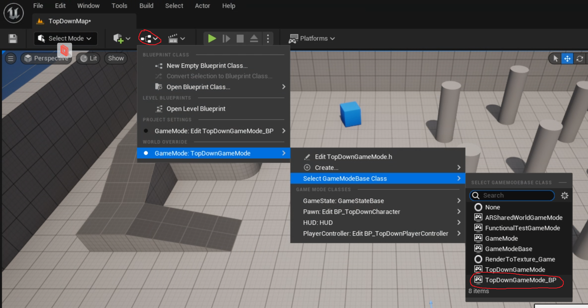
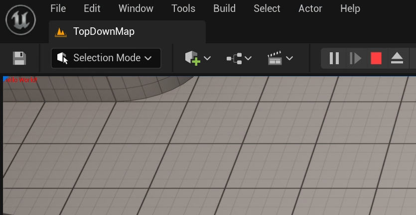
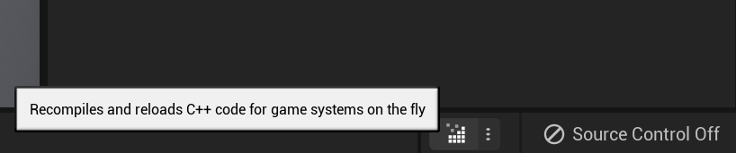
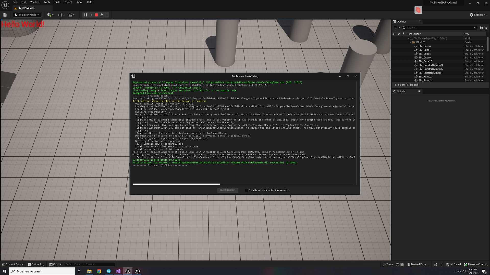
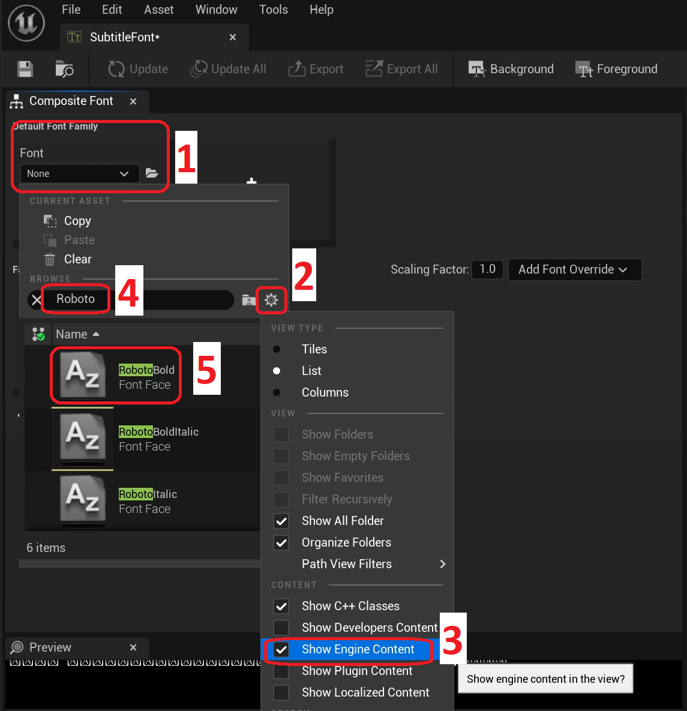
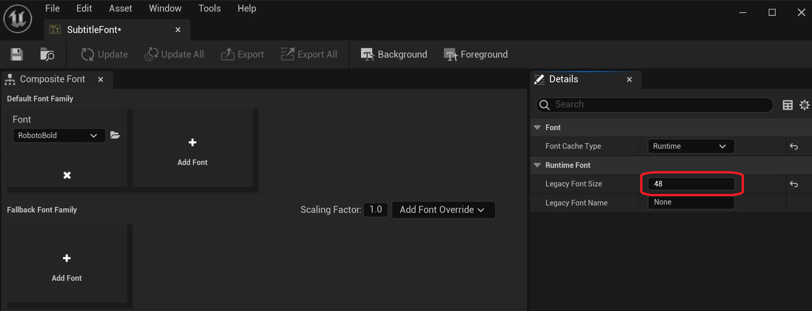
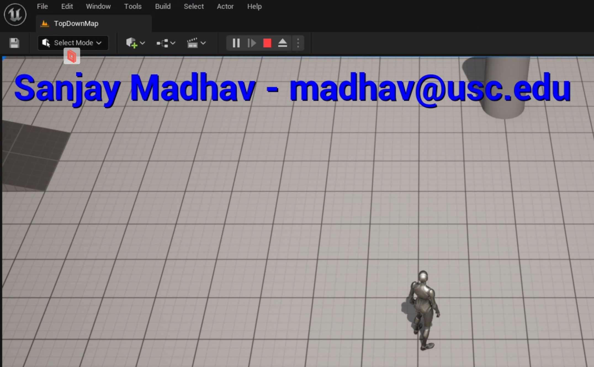

# Adding a HUD Class

Despite the name, you generally don't want to use the `AHUD` class to implement a heads-up display in an Unreal game anymore. It's a pretty old way that they've kept around primarly to add debug overlays and similar development utilities. Most larger game projects will use UMG (Unreal Motion Graphics) to implement the actual HUD for the game, which will be covered in a later assignment.

In our case, we'll be using the HUD to add a text overlay that will serve as a watermark for your assignment videos.

## Creating the HUD Class Files

Especially while you're still learning Unreal, it's usually easiest to add new C++ classes by using the editor, which can create barebones source files for you to work with and typically add any missing dependencies you'll need to inherit from the class.

1. If you're not already running the editor, run TopDown through Visual Studio
2. In the Editor menu, select Tools>New C++ Class...
3. First you have to pick a parent class. Select HUD and click Next
4. For the Name, call it TopDownHUD
5. Leave the other options as the defaults and click "Create Class"
6. After creating new classes, you want to close the editor to build again
7. When it asks you to reload the Visual Studio solution, say yes, and do the same when it asks you to stop debugging.

Now in Visual Studio, open up TopDownHUD.h. Excluding comments, it'll look like this:

```c++
#pragma once

#include "CoreMinimal.h"
#include "GameFramework/HUD.h"
#include "TopDownHUD.generated.h"

UCLASS()
class TOPDOWN_API ATopDownHUD : public AHUD
{
	GENERATED_BODY()
	
};
```

There are several interesting and non-Standard C++ things to talk about. We'll talk more about this in lecture next week, but here are some notes for now:

- Unreal does not use include guards, it uses `#pragma once` to prevent multiple inclusions
- `TopDownHUD.generated.h` is generated by UnrealHeaderTool in a pre-compilation step. It does a lot of macro magic that you generally don't have to ever worry about. The generated.h must ***always*** be the last header included (except for the rare cases where the file doesn't need a generated.h).
- The `UCLASS()` macro is used to mark classes which ultimately inherit from `UObject`, and thus support things like garbage collection, serialization, and networking. Inside the parenthesis you can put different modifiers as needed, but in this case we don't need any
- The `TOPDOWN_API` is something that Unreal needs to define whether a class is exportable and in which dll it's exported in. This will become more relevant when working across multiple modules (which we won't do yet)
- Notice how despite us requesting the name TopDownHUD, the class is named `ATopDownHUD` and inherits from `AHUD`. This is because Unreal has a strict [naming convention](https://docs.unrealengine.com/4.26/en-US/ProductionPipelines/DevelopmentSetup/CodingStandard/#namingconventions) for classes and structs. The `A` in front means that it is a descendent of `AActor`. If you don't follow the convention properly, you'll get an error from UnrealHeaderTool
- The `GENERATED_BODY()` is just boilerplate that goes in every UClass. You never put anything in the parenthesis

## Getting the HUD to Draw Something

One of the most difficult aspects of learning how to program in Unreal is that it's a massive and established codebase, and you will never know what all of it does. In this case, we want to override functionality to get the HUD to draw our text, but where do you start?

For most of the actor classes, the documentation online is fairly solid. Rather than just telling you the answer, I'm going to walk you through a first-person account of how I figured out what to override and the steps I took. You should follow along to learn the process that you'll need to do on your own moving forward:

1. The starting point is to just Google "AHUD Unreal" find the corresponding API reference page
2. I want to draw, so I search the page for draw
3. Hmm, there's quite `Draw*` functions for various things like lines, materials, textures, etc
4. Do any of these functions tell me how I tell my HUD subclass what I want it to draw?
5. Oh there's a `DrawHUD` function. What does the description say? Ok, this seems promising!
6. It sounds like I need to override `DrawHUD` in my class
7. Back in Visual Studio, I go back to TopDownHUD.h and then right click on the parent class header (GameFramework/HUD.h) and open it
8. In HUD.h I find the declaration of `DrawHUD` and copy that line
9. Then back in TopDownHUD.h, I paste the declaration and fix the tabbing because Visual Studio likes to mess it up
10. I add `override` to the declaration as you must use the `override` keyword when overriding a parent class function in Unreal (otherwise you'll get a compile error)
11. You can right click on your new `DrawHUD` declaration and use the quick actions menu to automatically add an empty implementation in TopDownHUD.cpp
12. Now we have an empty function that we need to implement
13. Make sure the TopDown project compiles before moving on (although if I'm being honest, I didn't do this step because I believed in myself)

The first rule of overriding is that you most likely need to call the parent class functionality. Unreal has handy typedef magic that behind the scenes will always declare a valid `Super` type in a UClass. So if you want to call the parent class `DrawHUD` function, you can do this:

```c++
Super::DrawHUD();
```

Now we need to draw the text. If you go back to HUD.h you'll see that there's a `DrawText` function which seems very promising. Your job is to figure out how to use `DrawText` to write "Hello World!" in red the top left corner of the game screen. Here are some hints:

- `FString` is Unreal's string class (as Unreal rarely uses STL), and it works pretty similar to what you'd expect although many of the functions have different names
- For string literals, you have to enclose them with the `TEXT()` macro. So you can't just say `"Hello World!"`, you have to say `TEXT("Hello World!")`
- `FLinearColor` has the most common colors defined as statics so you can use one of those for red
- For the x/y coordinates, just set them to `0, 0` for now.
- You can just not pass in any additional parameters beyond the first four, as they will use the default values then.
- It's okay if you're not entirely sure whether you picked the correct coordinates or whatever, just put in your guess for now and you'll find out what it looks like when it runs

Now try to build TopDown. If it builds, great, let's run it.

## Making ATopDownHUD the Default HUD Class

If you play your game in editor, you may be disappointed that you don't see any red text! This is because we need to tell Unreal that we want to use `ATopDownHUD` as the default HUD class. This default HUD class is specified in the Game Mode. Although you could set the default HUD class in code, generally it's better to do this sort of configuration with a blueprint.

We'll make a TopDownGameMode_BP that inherits from the native `ATopDownGameMode` class. In the Unreal editor:

1. Press Ctrl+Space to open the Content Drawer
2. Under "Content", make a new folder called "Blueprints"
3. Open the "Blueprints" folder
4. Right click in empty space in the folder select "Blueprint Class" from under "Create Basic Asset":
   
5. Click the All Classes down arrow and search for TopDownGameMode, and select it:
   
6. Name the blueprint "TopDownGameMode_BP"
7. Double-click on it to open up the details blueprint editor for TopDownGameMode_BP
8. In the blueprint editor, in the details on the right you want to change the "HUD Class" property to "TopDownHUD":
   
9. In the top left corner of the blueprint editor, click Compile and then Save
10. Close the blueprint editor

{: .warn }
When changing blueprints, you should get in the habit of clicking Compile, and if it compiles successfully, Save.

Now you have a blueprint for the default game mode you want to use. To set this:

1. Edit>Project Settings...
2. Search for "gamemode"
3. Change "Default GameMode" to "TopDownGameMode_BP"
4. Because the map has the game mode overriden, you also need to fix this. To do this, click on the blueprint button on the toolbar and under the "World Override" for the game mode, change the "GameModeBase Class" to `TopDownGameMode_BP`:
   
5. Click the save button in the editor to save the map
6. Now play the game in editor. You should see red text in the top left corner, though it will be extremely small:
   

If you don't see anything, while the game is running, switch into Visual Studio and put a breakpoint in the `DrawHUD` function you added. If it doesn't get hit, make sure you've setup the default game mode and HUD class for it properly.

## Making Quick Changes With Live Coding

The Hello World text is probably too small (at least it was on my 4K monitor). Or maybe you don't like the position on screen? While you *could* close the editor, change the code, build in Visual Studio and run again, that's a pretty slow iteration time. For this reason, Epic has a Live Coding feature in Unreal.

1. While the game is still running in editor, switch into Visual Studio and start editing the code how you want to. For example, change the `DrawText` call so you pass in `nullptr` for the font, but increase the `DrawScale` parameter to `5.0f`.
2. Save the source file in Visual Studio and switch back to Unreal
3. In Unreal, press **CTRL+ALT+F11** to trigger a live coding build. Alternatively, you can also trigger live coding by clicking this button in the bottom right corner of the editor:
   
4. It'll take a few seconds to build, but when it finishes you'll see the results update in real-time, even while the game is running in Play-in-Editor (PIE):
   
5. Now experiment a little bit more with your text location, size, and color

{: .danger }
Live coding works very well if you're *only* making changes to .cpp files. If you're modifying headers and/or creating new classes, it's a bit more suspect. I usually recommend closing and relaunching the editor when adding new classes, especially. While nothing will irrevocably break if you try to live code bigger changes, it may still have odd or unexpected results.

## Make the Font Look Better

Unfortunately, increasing the `DrawScale` to `5.0f` like I did makes the text look pretty bad as it's not using a higher font point size.

Maybe instead we could pass in a different `Font` parameter? And what font does it use anyway if you pass in `NULL`? To answer these questions, we need to take advantage of the full source code access.

1. In Visual Studio, press **Ctrl+T** to bring up a special type of search box and type "HUD.cpp" to quickly open the HUD.cpp file
2. Now press **Ctrl+F** and type "DrawText" to find the implementation of the function, which is on line 926
3. If you look at line 935, you'll see what it does when `Font` is `NULL`. It uses whatever font is returned by `GEngine->GetMediumFont()`, which sounds promising
4. Right click on `GetMediumFont()` to go to its definition. You'll see there's other functions like `GetSubtitleFont()` which sounds good!
5. Change the code in your `DrawHUD` to use `GEngine->GetSubtitleFont()` and do a live code build and...can you tell a difference?
6. Unfortunately, nothing changes...
7. So that begs the question, where do these fonts get declared? It seems like they're all just the same right now. Maybe there's a project setting for them?
8. If you type in "Font" in the project settings window, you'll see that currently none of the fonts are declared to anything, so it must just be using some built-in default for all of them. Let's change that

### Setting a New Default Subtitle Font

1. In the Content Drawer, add a new folder under "Content" called "Fonts", and open the folder
2. Right click and create a User Interface>Font
3. Name it "SubtitleFont"
4. Open up the font to view the font editor, which is a little weird. But under "Default Font Family":
   
   1. Click the dropdown under the Font to bring up the selection window
   2. Click the gear icon to change the filter settings
   3. Check "Show Engine Content"
   4. Type in "Roboto"
   5. Select "RobotoBold"

5. Next, change the "Legacy Font Size" property to 48:
   
6. Save the SubtitleFont asset
7. Now go to the Project Settings and set the "Subtitle Font" property to the SubtitleFont asset you just made
8. Changing this font will only apply on an editor restart, so close the editor and then run again
9. Now when you'll run the font will be *HUGE*. So change the `DrawScale` parameter back to `1.0f` and do a live code build:
10. Go ahead and comment out the `DrawText` call that adds this "Hello World!".

## **Let's Make it a Watermark**

To help identify the game as yours in the videos you'll make, you ***must*** add a `DrawText` that outputs:

- "Your Name - youremail@usc.edu"
- Using the SubtitleFont you made in the previous section
- Clearly visible on the screen (a corner is fine)
- In a color of your choice, as long as it's legible (eg. don't pick white or something that'll be hard to make out)
- You can have extra text if you want to, but minimally you must satisfy the above

For example, my game's watermark looks like this. I actually drew the text twice to create a shadow effect, but you aren't required to do that:



Make sure you submit all your changes to Perforce.

Now it's time to [submit your assignment](01-04.html).
