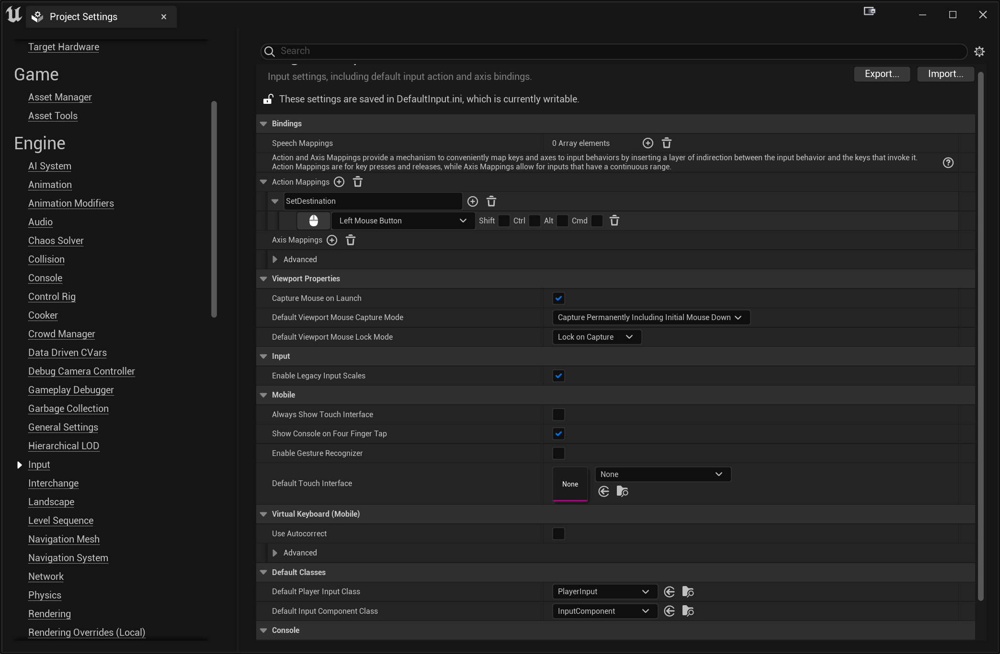
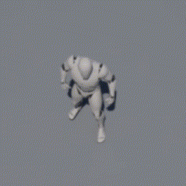

# Movement Controls

In this part, we're going to change the movement controls so the player moves with WASD and jumps with the space bar, instead of using click-to-move.

## Removing Code from TopDownPlayerController

The top down template uses click-to-move, so the `TopDownPlayerController` has quite a few functions that we won't need when doing WASD movement instead. Rather than keep this old code around, we're going to delete it.

In the header, remove every member variable as well as every function after `SetupInputComponent` (so the member functions on lines 39-42).

Remember that when modifying header code, you won't be able to live code your changes.

In the cpp file:

- In the constructor, set `bShowMouseCursor` to `false`
- Remove everything in `PlayerTick` except for the `Super` call
- In `SetupInputComponent`, remove the `BindAction` and `BindTouch` calls
- Delete the functions that you deleted from the header

Now when you run the game, you won't be able to move your player anymore. However you'll notice you still have that green circle target, which we want to remove.

## Removing Code from TopDownCharacter

In the header file, change the `TopDownCameraComponent` and `CameraBoom` members to be `TObjectPtr`s instead of raw pointers (you don't need to change the getter functions; just changing the `UPROPERTY` declarations is enough)

## Input Mappings

Unreal has two ways to handle input mappings. The default way is how input mappings work in UE4. For UE5, there's a new [Enhanced Input Plugin](https://docs.unrealengine.com/5.0/en-US/enhanced-input-in-unreal-engine/). We may explore it a bit later, but for now we're going to stick to the default approach.

To setup mappings, in the editor go to your Project Settings. Scroll down to Engine and Input. You'll see the mappings which were setup for the template:



There are two types of mappings:

- **Action Mappings** are used for one-off actions like pressing a button to jump or our click in our click to move (which was "SetDestination")
- **Axis Mappings** are used for a range of motion, typically for movement or controlling the camera

We're going to remove some unneeded mappings and add some new ones:

1. Since we aren't going to use click-to-move anymore, let's remove the `SetDestination` mapping by clicking the trash can icon next to the mapping name.
2. Now add a new action mapping by clicking the + icon to the right of "Action Mappings" and call it `Jump`. Map it to Space Bar.
3. So that we can also support a controller (just in case), let's also add a controller mapping for `Jump` . Click the + to the right of the Jump text and add "Gamepad Face Button Bottom"
4. Add a new axis mapping called `MoveForward`:
   1. Map the "W" key to scale `1.0` (to move forward)
   2. Map the "S" key to scale `-1.0` (to move backward)
   3. Map "Gamepad Left Thumbstick Y-Axis" to scale `1.0`

5. Add a new axis mapping called `MoveRight`:
   1. Map the "D" key to scale `1.0`
   2. Map the "A" key to scale `-1.0`
   3. Map "Gamepad Left Thumbstick X-Axis" to scale `1.0`


## Adding Stub Functions

Keep in mind that modifying the header means you can't use Live Coding. So one approach is to modify the header to add new functions and create stub (or empty) implementations of the functions in the C++. This way you can then run the editor and use Live Coding as you're implementing the functions.

We're going to need to add three functions (they shouldn't be `UFUNCTION`s) to `TopDownPlayerController`:

- One that responds to the `Jump` action mapping
- One that responds to the `MoveForward` axis mapping
- One that responds to the `MoveRight` axis mapping

Functions that respond to an action mapping take in no parameters, while functions that respond to axis mappings take in a single float (you can just call it `Value`). Pick names for your functions that you think are appropriate (for example I chose to call the first function `OnJumpAction`).

Add these declarations and stub implementations and run the editor again.

## Hooking Up MoveForward

We have to tell Unreal that we want to associate the `MoveForward` action mapping with the function we created. You make these bindings in the `SetupInputComponent` function, after the `Super` call.

There's a member called `InputComponent` and it has a `BindAxis` function. Suppose the member function  you want to bind to `MoveForward` is called `OnMoveForwardAxis`. To setup this binding, you'd need this code:

```c++
InputComponent->BindAxis("MoveForward", this, &ATopDownPlayerController::OnMoveForwardAxis);
```

So what should you do in the implementation of `OnMoveForwardAxis`? Well, in a controller you can get a pointer to the pawn it's controlling with `GetPawn()`. Keep in mind it's possible this is `nullptr`, so you always need to validate the pointer. Once you have this pawn there's an `AddMovementInput` function that takes in a vector direction and the fractional speed you want to move in that direction (which is just the `Value` your function takes in, in this case). So to handle `MoveForward` you just need to add the movement input in the direction corresponding to forward!

{: .note }
Although you can ultimately use whatever coordinate system you want to, the default in Unreal is: +X is Forward, +Y is to the Right, and +Z is Up (same as in the 3D games in ITP 380). We'll stick to this coordinate system for now. You can also get these basis vectors as constants for example `FVector::ForwardVector` corresponds to `<1,0,0>`.

Now if you compile and Play in Editor (PIE), it may initially seem like your forward movement isn't working. This is because the default behavior of PIE is that the game window doesn't get focus and you have to click on the window for it to accept keyboard input. This is super annoying, so we're going to change this:

1. Click the three vertical green dots to the right of the "Play" button in the Unreal Editor and go to "Advanced Settings"
2. Check the "Game Gets Mouse Control" box

Now hopefully you can use W/S to move your character forward and back!

## Hooking Up MoveRight

Now hook up `MoveRight` in the same exact way, except the direction to move in is different. You should now be able to move as you'd expect using WASD.

## Hooking Up Jump

`InputComponent` also has a `BindAction` function that's very similar to `BindAxis`, but it also takes in a parameter for whether you want the function to get called when the mapping is first pressed or when it's released. For example, this is the how to bind to a pressed event for `Jump`, assuming the function is called `OnJumpAction`:

```c++
InputComponent->BindAction("Jump", IE_Pressed, this, &ATopDownPlayerController::OnJumpAction);
```

So how do you jump?

Well, it turns out we know that in normal gameplay, our `TopDownPlayerController` is controlling a `Character`, which is more powerful than a `Pawn` because it has a `CharacterMovementComponent`. One of the things `CharacterMovementComponent` (CMC) knows how to do is jump!

You can use `GetCharacter()` in a player controller to get a pointer to the character (if it exists). Again, keep in mind that this may be null.

Once you have a character use `GetCharacterMovement()` to get the pointer to the CMC. Then call `DoJump` on the CMC and pass in false. You'll need to include `"GameFramework/CharacterMovementComponent.h"` or you'll get an error that you're dereferencing a pointer to an incomplete type.

Now you should be able to jump by pressing the space bar!



{: .note}
Your character will look different from the animated GIFs as you have the new higher-quality UE5 mannequin model, but it will still work roughly the same.

Next up, [puzzle component](02-02.html)!
