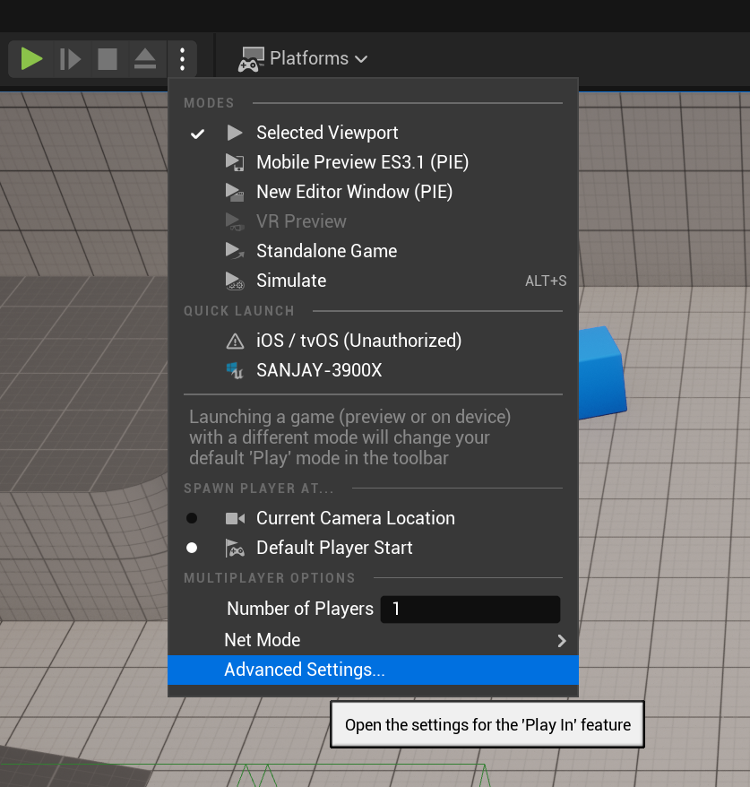

# Movement Controls

In this part, we're going to change the movement controls so the player moves with WASD and jumps with the space bar, instead of using click-to-move.

## Removing Code from TopDownPlayerController

The top down template uses click-to-move, so the `TopDownPlayerController` has quite a few functions that we won't need when doing WASD movement instead. Rather than keep this old code around, we're going to delete it.

In the header:

* Remove every member variable *except* for the `DefaultMappingContext` (they're spread out across several sections)
* Keep the constructor, `SetupInputComponent`, and `BeginPlay` functions, but remove the rest of the member functions

Remember that when modifying header code, you won't be able to live code your changes.

In the cpp file:

- In the constructor, set `bShowMouseCursor` to `false` and remove the lines for `CachedDestination` and `FollowTime`
- Delete the functions that you deleted from the header
- In `SetupInputComponent`, remove the `BindAction` calls (but keep the if)

Confirm that your code still compiles.

Now in TopDownPlayerController.h, add an include for `"InputAction.h"`. Remember this should go ***before*** the generated.h include.

Next, add the following member variables to the class:

```c++
UPROPERTY(EditAnywhere, BlueprintReadOnly, Category=Input)
TObjectPtr<class UInputAction> JumpAction;

UPROPERTY(EditAnywhere, BlueprintReadOnly, Category=Input)
TObjectPtr<class UInputAction> MoveForwardAction;

UPROPERTY(EditAnywhere, BlueprintReadOnly, Category=Input)
TObjectPtr<class UInputAction> MoveRightAction;
```

## Input Mappings

Unreal has two ways to handle input mappings. The recommended way to handle input in UE5 is with the [Enhanced Input Plugin](https://docs.unrealengine.com/5.0/en-US/enhanced-input-in-unreal-engine/). The old UE4 way of doing input mappings is still in the engine, but we'll focus on the UE5 method.

Each input action is a separate data asset. In the Content Drawer, browse to Content>TopDown>Input>Actions. In here, right click and create a new Input>Input Action:


Name the new action `IA_Jump`. Open the editor for `IA_Jump` and add a trigger for "Pressed" as you want this action to only occur on the press of jump:


 Next, make another action called `IA_MoveForward`. In the editor for this, change the Value Type to "Axis1D (float)":


Next, in the Content Drawer, duplicate `IA_MoveForward`, rename it to  `IA_MoveRight` and save it.

To specify which keys correspond to the mapping, you need an Input Mapping Context. If you go up one folder in the Content Drawer, you'll see the default mapping setup for this project, `IMC_Default`:


Open `IMC_Default`. In here, first add a mapping for `IA_Jump`, set the key to the Space Bar, and leave all the advanced properties at their defaults:


Similarly, add a mapping for `IA_MoveForward`. Since you want W to be positive and S to be negative for moving along the forward vector, setting up the mapping requires adding two keys under `IA_MoveForward`. First, setup a mapping for `W` as you did for the jump one:


Next, click the plus button next to `IA_MoveForward` to create another mapping. Map this to S and add a "Modifier" of "Negate":


Now setup the same sort of mappings for `IA_MoveRight` except `D` is the normal input and `A` is the negated one:


After saving the mappings, go to BP_TopDownPlayerController. In here, make sure you set the Jump, Move Forward, and Move Right actions as appropriate and compile/save the blueprint:


## Adding Stub Functions

Usually, you typically don't want to modify the headers while using Live Coding. So one approach is to modify the header to add new functions and create stub (or empty) implementations of the functions in the C++. This way you can then run the editor and use Live Coding as you fill out the implementation of the functions.

After closing Unreal, add the following three functions to the `protected` section of `ATopDownPlayerController`:

```c++
void OnJumpAction();
void OnMoveForward(const FInputActionInstance& Instance);
void OnMoveRight(const FInputActionInstance& Instance);
```

For digital actions, such as the jump, we can just pass in no parameters. For axis actions, however, we need to pass in the `const FInputActionInstance&` parameter.

Add empty implementations for these functions to the .cpp, and launch Unreal again.

## MoveForward

We have to tell Unreal that we want to associate the `MoveForward` action mapping with the function we created. You make these bindings in the `SetupInputComponent` function, inside the `if` statement which gets the `EnhancedInputComponent`.

Add the following line in `SetupInputComponent` to tell it to call `OnMoveForward` whenever the `MoveForwardAction` (which we've set to `IA_MoveForward` in the blueprint) is triggered:

```c++
EnhancedInputComponent->BindAction(MoveForwardAction, ETriggerEvent::Triggered, this, &ATopDownPlayerController::OnMoveForward);
```

Use Ctrl+Alt+F11 to do a live coding build, and make sure it compiles.

So what should you do in the implementation of `OnMoveForward`? You want to get the 1D axis value (as a float) and then tell the pawn we're controlling to move in the world forward direction by that amount.

This corresponds to:

```c++
if (APawn* MyPawn = GetPawn())
{
	float AxisValue = Instance.GetValue().Get<float>();
	MyPawn->AddMovementInput(FVector::ForwardVector, AxisValue);
}
```

{: .note }
Notice that the above code does not assume that `GetPawn()` won't return nullptr. Instead, we add an if check to make sure we only will run the subsequent code if `GetPawn()` returns a valid pointer.<br/><br/>Also, although you can use any coordinate system of your choosing, the default in Unreal is: +X is Forward, +Y is to the Right, and +Z is Up (same as in the 3D games in ITP 380). We'll stick to this coordinate system for now. You can also get these basis vectors as constants for example `FVector::ForwardVector` corresponds to `<1,0,0>`.

Now if you do a live code build and Play in Editor (PIE), it may initially seem like your forward movement isn't working. This is because the default behavior of PIE is that the game window doesn't get focus and you have to click on the window for it to accept keyboard input. This is super annoying, so we're going to change this:

1. Click the three vertical green dots to the right of the "Play" button in the Unreal Editor and go to "Advanced Settings":
   
2. Check the "Game Gets Mouse Control" box:
   

Now you should be able to use W/S to move your character forward and back!

## MoveRight

Now hook up `OnMoveRight` in the same exact way. Add a `BindAction` call in `SetupInputComponent`.  In `OnMoveRight`, you pass in a different direction vector into `AddMovementInput`. You should now be able to move as you'd expect using WASD.

## Jumping

For jumping, you also need to add one more `BindAction` call.

But how do you trigger the jump in `OnJumpAction`? First of all, because you don't have an `FInputActionInstance` parameter in this case, you can ignore getting any value from it. 

It turns out we know that in normal gameplay, our `TopDownPlayerController` is controlling a `Character`, which is more powerful than a `Pawn` because it has a `CharacterMovementComponent`. One of the things `CharacterMovementComponent` (CMC) knows how to do is jump!

You can use `GetCharacter()` in a player controller to get a pointer to the character (if it exists). Again, keep in mind that this may be null.

Once you have a character use `GetCharacterMovement()` to get the pointer to the CMC. Then call `DoJump` on the CMC and pass in false. You'll also need to include `"GameFramework/CharacterMovementComponent.h"` or you'll get an error that you're dereferencing a pointer to an incomplete type.

Now you should be able to jump by pressing the space bar!


{: .note}
Your character will look different from the animated GIFs as you have the new higher-quality UE5 mannequin model, but it will still work roughly the same.

Next up, [puzzle component](02-02.html)!
