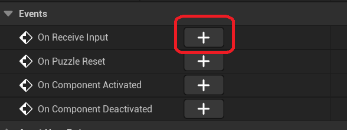

# Creating UPuzzleComponent

The fundamental building block of our puzzle system is `UPuzzleComponent`. The basic idea is that each PuzzleComponent has a single output value that's a binary true or false. The puzzle component can target its output at a single actor in the level (that should also have a puzzle component). Every time the output changes, the target actor is signaled with the new true/false value.

This means that each PuzzleComponent only has one output to another actor with a PuzzleComponent. However, an actor can *receive* the output of multiple puzzle components. So even though it might seem like a single output limits the design space, it's actually possible to still design complex behaviors.

For example, let's say there are three switches A, B, and C. You want all three switches to be "on" in order to open the door. The door can receive the signal from all three switches, and once all three are true it can open.

Furthermore, as it'll be common that a puzzle requires multiple steps completed to trigger something else, we can break it down even further. Instead of putting the logic to receive multiple signals in the door, we can add an "AND" actor in between. So, the three switches will actually send the signal to the "AND" actor and then the "AND" actor is what sends the signal to the door.

In this part of the assignment, we're going to implement `UPuzzleComponent` and then use it to add a basic puzzle where a single switch activates a light. Then we'll implement the "AND" node and use it to make a puzzle where you have to hit two switches to activate a light. Then, we'll add some debug visualization to see the flow of values in real-time while playing the game.

This part of the assignment is essentially a walkthrough. However, it's important you're understanding what you're doing, as the last part of this lab will require you to implement a couple of new puzzle behaviors solely based on the design.

## UPuzzleComponent Declarations

In the editor, do Tools>New C++ Class. Make a class that inherits from Actor Component, and call it `PuzzleComponent`. Reload the project in Visual Studio when it asks.

When you make a new component, by default it has ticking enabled, but for performance reasons if you don't need the component to `Tick` every frame, you should disable it. In our case, we're going to make PuzzleComponent purely event-based, so we don't need to tick.

To disable ticking, set the bool in the constructor to `false`, and also remove the `TickComponent` declaration/implementation.

Now you need to add some declarations to the header

Members:

- `bIsOutputActive` - a `bool` `UPROPERTY` that's `Transient` and `BlueprintReadOnly`, defaults to false. This will be used to track whether or out the output is active
- `OutputActor` - a `TSoftObjectPtr<AActor>` `UPROPERTY` that's `EditInstanceOnly`. This will be used to track which actor this puzzle component should send the output to

Functions:

- `SetOutputActive` - (`UFUNCTION` that's `BlueprintCallable`) - is `virtual`, returns `void` and takes in a `bool` specifying a new value for `bIsOutputActive`. Since this is a blueprint function, you should use the special comment syntax 
- `NativeReceiveInput` - (***not*** a `UFUNCTION`) a `virtual` function that returns `void`, and takes in two parameters: an `AActor` pointer (just a raw pointer) that specifies which actor is sending the incoming value, and a `bool` specifying the incoming value
- `PuzzleReset` - (`UFUNCTION` that's `BlueprintCallable`) a `virtual` function that returns `void` and takes no parameters

### SetOutputActive Implementation

This function should immediately return if the `bInOutputActive` is the same as the current `bIsOutputActive`.

If it's a new value, set `bIsOutputActive` to the new value. Next you need to try to resolve the `OutputActor` soft object pointer with `Get()`. If it works (eg. it doesn't return `nullptr`), you can use the `FindComponentByClass` template function to get a pointer to the `PuzzleComponent` for the output actor, which would roughly look like this (assuming you resolved `OutputActor` to `OutActor`):

```c++
UPuzzleComponent* PuzzleComp = OutActor->FindComponentByClass<UPuzzleComponent>();
```

Remember it's possible `PuzzleComp` is `nullptr`, in which case you can't do anything with it. But if it's not null, you'll want to call `NativeReceiveInput` on **_the output actor's_** puzzle component (which is what you just got with the line of code above), passing in `GetOwner()` as the actor sending the input, and whatever the new value of `bIsOuputActive` is. This is how this actor's PuzzleComponent notifies the other actor's PuzzleComponent about a new value.

### NativeReceiveInput Implementation

For now, nothing in here -- we'll change this in a second.

### PuzzleReset Implementation

For now, this will simply call `SetOutputActive`, passing in `false`.

### Adding Some Delegates

To simplify the process by which actors can hook into their puzzle components, we need to use delegates. `BlueprintImplementableEvent` really isn't designed for this particular use case (it's better for an is-a relationship, as opposed to our has-a situation). To solve this, we'll need to use delegates as discussed in lecture.

First, in the `PuzzleComponent.h` header, you have to add declarations of the two delegate types. This should go before the declaration of `UPuzzleComponent`, but after the includes:

```c++
DECLARE_DYNAMIC_MULTICAST_DELEGATE_TwoParams(FPuzzleComponentOnReceiveInput, class AActor*, InputActor, bool, bValue);
DECLARE_DYNAMIC_MULTICAST_DELEGATE(FPuzzleComponentOnPuzzleReset);
```

Next, in the member data you need to add two `UPROPERTY`s of this type, with the specifier `BlueprintAssignable`:

```c++
UPROPERTY(BlueprintAssignable)
FPuzzleComponentOnReceiveInput OnReceiveInput;

UPROPERTY(BlueprintAssignable)
FPuzzleComponentOnPuzzleReset OnPuzzleReset;
```

Now let's broadcast to these delegates in the correct spots.

In `NativeReceiveInput` add the following line to trigger the `OnReceiveInput` delegate:

```c++
OnReceiveInput.Broadcast(InputActor, bIncomingValue);
```

Similarly, at the end of `PuzzleReset` add a Broadcast to `OnPuzzleReset` (except that one has no parameters).

We'll see how to hook up to these in a blueprint a bit later.

## Setting Up a Puzzle Floor Switch

Open up the Content Drawer, and make a new folder under "Blueprints" called "Puzzles."

Create a new blueprint named `PuzzleFloorSwitch_BP` which inherits from `TriggerBoxPlayer_BP`.

In the blueprint editor, click on the CollisionComponent details view, and set the Box Extents to `(40, 40, 10)`:


Now we want to add a Static Mesh component. To add components, click the add button in the top left corner on the blueprint and then select the desired component:


In the StaticMesh details:

* Set the "Static Mesh" to `SM_Cube`, which is a 1m x 1m x 1m cube
* Set the z-scale to `0.05`.
* Set the x and y location to `-50`
* Change Materials>Element 0 to `M_Solid`

The switch should look like this in the blueprint viewport:


Now place an instance of the switch in the level. You'll notice that you can see it in the editor view, but you won't see it when you hit play. This is because `TriggerBase` defaults to visible in editor but not in game.

To fix this, in the blueprint details for `PuzzleFloorSwitch_BP` itself, uncheck "Actor Hidden in Game". Now when you run you'll see the trigger, but also the collision box and the sprite, which we don't want to see.

To hide the Collision Component, go to its details in the blueprint and change "Hidden in Game" to true. To hide the sprite component, you need to go back to the root properties of `PuzzleFloorSwitch_BP` and set "Editor Billboard Scale" to 0. The billboard only shows up in editor builds, but we don't need it for the puzzle floor switch anymore as we now have a visible mesh.

Now when you run the game, you should see the trigger in the level as you might expect. It will look similar to this:


Now let's make it so the trigger glows when the player overlaps with it. In the Content Drawer go to Content>LevelPrototyping>Materials. Right click and duplicate `M_Solid`, calling the copy `FloorSwitchMaterial`. Open up your new material. Drag off the Emissive Color pin to create a VectorParameter called "GlowColor", keeping it the default value of all zeroes:


{: .note }
Compared to the material we saw in the video for the character, this is a more explicit way of authoring materials where you can directly see your potential outputs. Emissive is what adds a glow effect, to signify that the material is "emitting" a color as opposed to the being a property of the surface, like base color or roughness.

Back in `PuzzleFloorSwitch_BP`, change the static mesh's material the new material. Then override the "On Player Begin Overlap" and "On Player End Overlap" Blueprint functions. You can drag the Static Mesh Component onto the blueprint graph and set the `GlowColor` vector parameter to red when it overlaps, and back to black when it does not. (If you don't remember how to do this, check the flipped classroom video).

Running the game, if you walk on and off the trigger, you should see it glow like this (again, your graphics will look slightly different than in the GIF):


Now let's add a PuzzleComponent to the switch blueprint. Just use the add component option in the Blueprint Editor again. This time pick "Puzzle" (the component part of the name doesn't show up). Then in the PlayerBegin/End Overlap functions, call `SetOutputActive` on the PuzzleComponent as appropriate (true on begin, false on end).

If you run the game, it will still look the same as you haven't hooked up the puzzle component's output yet.

## Adding a Puzzle Light

In the Puzzles folder, create a new BP called `PuzzleLight_BP` that inherits from PointLight. Set the properties of the Point Light Component so the "Light Color" is blue, and "Visible" is false (because by default, it's not activated yet so we don't want it to be visible).

Next, add a Puzzle Component to `PuzzleLight_BP`.

Now it's time to use that delegate we setup in code. In the blueprint component list, make sure Puzzle is selected. On the Details pane, look under events and you'll see a big green + button next to "On Receive Input":



Click the + button next to the event and it'll add an event to the graph called "On Receive Input (Puzzle)". What you want to do with this is just call "Set Visibility" on the point light component, passing in the `Value` from the "On Receive Input" as the visibility. This way, when the input is true, the light will turn on, and if it's false, the light will turn off.

## Placing in the Level

Now place a puzzle light somewhere in the level near your switch. Now select the floor switch in the level. In the details, select the Puzzle Component, and you'll see the "Output Actor" parameter. Set this to the puzzle light you just place in the level (you can use the eye dropper to select from the viewport, or otherwise type the name to find it):


If everything is setup properly, the light should turn on and off as you walk on/off the switch, like this:


## Making a Switch Stay Enabled + Some Colors

Right now our switch is disabled when we step off of it, so it's like a pressure plate. However, suppose we just want a switch that just stays enabled after it's triggered the first time.

Also, we'd like to make switches be able to glow in different colors than just red.

To do this, we can add two variables to `PuzzleFloorSwitch_BP`:

- A Boolean that says if the switch is disabled when the player steps off of it (set to true by default)
- A Linear Color that sets the color when you step on the switch (set to a Red color by default)

Make sure both of these variables are set to "Instance Editable," which is what allows you to edit the variable on an instance placed in the level.

Now in the blueprint script:

1. In Begin Overlap, change it so you use your color variable instead of the hardcoded one (you don't have to do anything to convert it, just dragging the Linear Color to the vector will automatically use a conversion node)
2. In End Overlap, use a "Branch" node to only reset the color and set the output to false your "disable when step off" bool is true

Now place a second PuzzleFloorSwitch in the level, in the vicinity of the first switch. In its properties, make the glow color green and set the "disable when step off" bool to false. Verify that this new switch works as you expect, and your old switch still works the same.

Now you want to add a Text Render Actor to the level. To do this, click the add button and select "Place Actors Panel":


From here, type text to find "Text Render Actor" and drag one into the level near your switches.

Set the parameters are follows:

* Set the text to "Original"
* Set the scale uniformly to `3.0`
* If your text is facing backwards, rotate it to face the correct direction (for me, I had to rotate -180 degrees on the z-axis)

We'll be using these text render actors to help identify the switches in your video.

## Adding PuzzleAND

Now we're going to make an actor whose sole purpose is to function as an AND node. It will take in multiple inputs, and then once all those inputs are true, it will set its output to true.

In the Puzzles folder, create a new blueprint that just inherits from Actor, and call it `PuzzleAND_BP`. Add a Puzzle Component to it and an "On Receive Input" event.

The way we're going to handle tracking the input actors is with an array of soft object Actor references that correspond to the actors which are required to trigger the puzzle.

First, create a variable called `RequiredPuzzles` and make it an Actor Soft Object Reference and Instance Editable. Then, click the blue circle to the right of "Variable Type" and select "Array" from the dropdown:


Then add an integer (just a single one, not an array) called `InputCount` which is initialized to zero. This doesn't need to be instance editable.

Then, in the Blueprint script for the OnReceiveInput event, add the following logic:

1. When you receive input you first should confirm the actor is in the `RequiredPuzzles` array (the array has a "Contains Item" function you can drag off of it)
2. If it is in the array, then your either increment or decrement `InputCount` based on whether `Value` is true or false
3. Finally, you set the output of the PuzzleComponent (for this AND node) to either true or false depending on the count -- if the count is equal to the `Length` of RequiredPuzzles, then the output should be true, otherwise false. You want to use the BlueprintCallable `SetOutputActive` function on the Puzzle Component for this.

## Testing PuzzleAND

In an area of the level separate from the original switches, add two more floor switches:

- One floor switch should reset when you step off of it, set that to glow red
- The other floor switch should not reset when you step off of it, set that to glow green

Add another TextRenderActor that says "AND" near these two switches (you can just duplicate the "Original" one and change the text).

Now place a PuzzleLight near these two switches, as well as a PuzzleAND.

Hook it up so these two new switches send their output to the PuzzleAND, and the PuzzleAND sends its output to the light. Then for the PuzzleAND instance's `RequiredPuzzles`, add two elements that point to the two switches.

If everything is setup properly, you should get behavior that looks something like this:


## Adding Debug Visualization

For complex puzzles, it would be nice to be able to visualize the flow of inputs between the different puzzles. To do this, we'll add some debug drawing code. The steps are a little difficult to figure out on your own, so here's a pretty detailed breakdown:

1. In PuzzleComponent.h add a public C++ function that returns void/no parameters. We'll call it `DebugDrawOutput`

2. In PuzzleComponent.cpp, add an include for `"DrawDebugHelpers.h"`

3. Put the following code in the implementation of `DebugDrawOutput`:

   ```c++
   #if ENABLE_DRAW_DEBUG
   	if (AActor* OutActor = OutputActor.Get())
   	{
   		const FColor DrawColor = bIsOutputActive ? FColor::Green : FColor::Black;
   		DrawDebugDirectionalArrow(GetWorld(), GetOwner()->GetActorLocation(), OutActor->GetActorLocation(), 150.0f, DrawColor);
   	}
   #endif
   ```

   This first verifies that the `ENABLE_DRAW_DEBUG` is true. Next it uses a `DrawDebug` function to draw an arrow between the owner of the PuzzleComponent and the output actor.

4. In TopDownHUD.cpp, add includes for `"DrawDebugHelpers.h"` and `"PuzzleComponent.h"`

5. At the end of `DrawHUD`, add the following:

   ```c++
   #if ENABLE_DRAW_DEBUG
   	for (TObjectIterator<UPuzzleComponent> Itr; Itr; ++Itr)
   	{
   		Itr->DebugDrawOutput();
   	}
   #endif
   ```


{:.note}
This code you added to TopDownHUD iterates over all the `UPuzzleComponent`s in the world and call `DebugDrawOuput` on each. This is not particularly efficient but it's okay for our debug purposes for now!

Live code build thisIf you did this properly, now when you run you should see arrows between your puzzle components, which helps more clearly visualize the flow. For example, this diagram clearly shows the state of this part of the puzzle:


Right now this debug visualization is always on. In the next assignment, you'll fix that.

Now that you have the building blocks of your puzzle system, it's time to [add more puzzles](02-03.html)!

