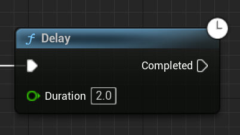

# Improving Interact

In this part of the assignment, you're going to significantly improve the interact functionality.

You will have to add new C++ functions and/or variables as appropriate to implement behaviors, as well as a handful of blueprint changes.

## Interact Glow

To make it more clear which object is the current "best candidate," add in a white glow effect for interactable objects. By default you can assume that the material parameter name is `"InteractGlow"` but give the option to change the parameter name in the interact component.

You should implement the behavior to set the material parameter value in a C++ function within `UInteractComponent` so that `UInteractSusbsytem::Tick` can enable/disable glow on the appropriate components. In the function in `UInteractComponent`, you can use `FindComponentByClass` to see if the actor has a `UStaticMeshComponent` and, if it does, call `SetVectorParameterValueOnMaterials` on the static mesh to set the `"InteractGlow"` parameter.

You will have to modify the lamp material (`M_Lamp`) to get the glow to work on the existing `TorchInteract_BP` objects. To do this, can just take the current Multiply node that is routed to emissive color and use an Add node to add the `"InteractGlow"` parameter to it (it'll make it look really white but that's ok for testing). The idea is that `"InteractGlow"` would default to `(0, 0, 0)` but then you can set it to `(1, 1, 1)` when you want to make the torch glow.

{:.test}
Confirm that the current best candidate is glowing (and it changes as appropriate): 

## Interact Hint

Add a hint text that is centered on the best candidate. The text should say something along the lines of `"[E] - Interact"` to your HUD (you can just use an `FString` even though for a real game we'd want this to be localizable). The simplest way to do this is just in `DrawHUD`, check if the `UInteractSubsystem` has a best candidate (you'll need to add a getter or make the variable `public`) and if it does, draw the hint text over it. You can use a `nullptr` font with a scale of `3.0f`.

*Hint*: There's a `Project` function you can use to get a screen space position. To center the text, you'll have to take advantage of `GetTextSize`.

{:.test}
You should now have an interact hint like this: 

## Improving Best Candidate Selection

Change the best candidate selection code so that it only picks a candidate that's "roughly" in front of the player and also within 200 units of the player (it's okay if you hardcode this number, though for a real game we wouldn't do that). If there are multiple candidates that satisfy this criteria, you should pick the one that's closest to being directly in front of the player (eg. don't just pick the shortest distance).

*Hint*: `FVector` has the typical functions you might expect. For example, there is a static `FVector::DotProduct` function and a member function called `Normalize`. Also, you can use `GetActorForwardVector()` to get the forward vector of the player character.

{: .note }
In Unreal, the default units is centimeters. So, 200 units is 200cm or 2m.

## Example of Behavior

To demonstrate these improvements to interacting, add a puzzle component to TorchInteract_BP whose output is active when the torch is on. Then place two torches near each other (so you can show how the candidate changes depending on your facing). Make it so a PuzzleLight only turns on when both torches are in their "on" state. Add a text render actor near these that says "Interact".

Here's an example of what's expected:

## Being Able to Enable/Disable Interaction

Right now if something has an `UInteractComponent`, it's always enabled. Add a `bool` in C++ that's `BlueprintReadWrite` which says whether the interaction is enabled (it should default to true). If the interaction is disabled, the system should never select it as the "best candidate" and any calls to `NativeInteract` should do nothing.

To demonstrate this, duplicate (don't inherit) `TorchInteract_BP` into a new `TimedTorchInteract_BP` and edit its "On Interact" blueprint script to add the following logic after the logic that turns on the particle system/puzzle output:

1. Disable interact on the interact component
2. Delay for 2 seconds using a "Delay" node (see below)
3. Reenable interact, turn off the particle system, set the puzzle output to not active, and set IsTurnedOn to false

To setup the "after 2 seconds" behavior, you can use a "Delay" node in the Blueprint, which will only execute the "Completed" pin after the duration passes:

{: .note }
The Delay node is what's called a "latent action" node in Blueprint (denoted by the clock in the top right corner). We'll discuss how these nodes work internally in a future lecture.

Next, add a Puzzle Component to `TimedTorchInteract_BP` whose output gets set to active when the torch is on, and inactive when the torch is off.

Hook up a `TimedTorchInteract_BP` to a `PuzzleLight` to demonstrate this behavior. Add a text render actor that says "Timed" near it.

## Enabling Audio on the VM
By default, your VM does not have an audio device so there's no sound output for Parsec to stream to you. Luckily, this is easy to fix.

1. Make sure your local machine has its volume loud enough so that you can hear it
2. On the VM:
   1. Download the [VB-Cable Driver Pack](https://download.vb-audio.com/Download_CABLE/VBCABLE_Driver_Pack43.zip)
   2. In Windows Explorer, go to the Downloads folder, right click on the zip and "Extract All..."
   3. After extracting, it will open the director with all the file run `VCABLE_Setup_X64.exe`
   4. Click "Install Driver" and then "Install" on the subsequent pop-up box. When the install completes, you should hear the Windows alert sound on the dialog box, because you now have an audio device.
   5. To double-check the sound's working, go to YouTube and try to play a video. If you don't hear anything, double-check that you have the volume turned on for your local machine.
   6. If Unreal is already running, you may have to exit and reload for Unreal to detect it.

## Adding Audio

We have a fire sound effect, so let's make the torches make the fire sound when they're on. To do this, add an "Audio Component" to both torch BPs. Use the `Fire01` (***NOT*** `Fire01_Cue`) looping sound that we imported from the starter content. Make sure the component isn't auto activated and set it active/inactive in the blueprint like we did with the particle system component.

{:.test}
You should now hear a fire sound effect when the torch is on.

Now that the interact system has been improved significantly, it's time to implement [an actor using `UPuzzleComponent` in C++](03-02.html)!

