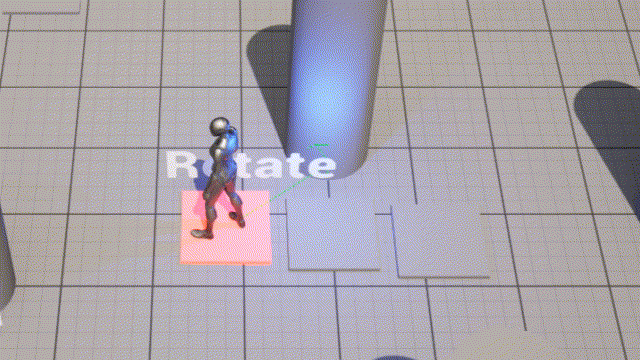

# PuzzleComponent in C++

To this point, we've created all the actors for puzzles in Blueprint. This is fine for basic logic, but more complex logic is difficult to build out in Blueprint. So, we're going to make an `APuzzleRotate` actor which has a `TArray` of multiple actors with puzzle components and periodically rotates which one has its `OutActor` connected to `APuzzleRotate`.

## Creating PuzzleRotate

Add a new C++ class that inherits from Actor called `PuzzleRotate`. You'll need to edit some C++ code now.

By default, Actors don't have a `RootComponent` and thus can't be placed in a level. So first, we need to add a root component. We'll use a `UBillboardComponent` so that we have a sprite we can click on in editor (it won't show up in game). To do this, add the following to the constructor for `APuzzleRotate`:

```c++
RootComponent = CreateDefaultSubobject<UBillboardComponent>("Root");
```

You will have to include `"Components/BillboardComponent.h"` for this to compile.

{: .note}
The `CreateDefaultSubobject` function is how you construct a component for the CDO specifically in the constructor of an actor. It will ***NOT*** work if you want to dynamically add a component at runtime. The template parameter is the type of component you want to construct, and the name is just a friendly name that it'll show in editor (though make sure you don't give multiple components in the same Actor the same name or it may end up in disaster).

Then, declare the following variable in the `protected` section:

```c++
// Our PuzzleComponent
UPROPERTY(VisibleAnywhere, BlueprintReadOnly)
TObjectPtr<class UPuzzleComponent> PuzzleComponent;
```

Next, declare the following variable in the `public` section:

```c++
// The input actors with puzzle components which we want to rotate between
UPROPERTY(EditInstanceOnly)
TArray<TSoftObjectPtr<class AActor>> InputActors;
```

Finally, you need to use `CreateDefaultSubobject` to create the `UPuzzleComponent` in the constructor. In this case, you want to assign the result of `CreateDefaultSubobject` to `PuzzleComponent` and the name should be `"Puzzle"`. You will need to `#include "PuzzleComponent.h"`.

Make sure this code compiles, and then go into editor and make a blueprint called `PuzzleRotate_BP` that inherits from `PuzzleRotate` and save it. Confirm that in the blueprint's list of components you see both the billboard component and the puzzle component.

{: .note }
You almost always should make a blueprint subclass for your C++ actors, just in case there's anything you want designers/artists to be able to tweak. It's a lot easier if you make the BP from the start so people place that instead of the C++ version. If you want to really enforce this you could make your C++ class `Abstract` so the editor doesn't let you place the C++ version in the level.

## Hooking up to OnReceiveInput

So far we've been using the `OnReceiveInput` delegate from Blueprint. However, it's also possible to register to dynamic delegates in C++ code, though the syntax is particular.

First, you need a native function that matches the parameters the delegate is expecting. This also needs to be marked as a `UFUNCTION`, though you don't need any specifiers. Add this declaration to PuzzleRotate.h:

```c++
UFUNCTION()
void OnReceiveInput(class AActor* InputActor, bool bValue);
```

Then add a stub implementation of this `OnReceiveInput` function into PuzzleRotate.cpp.

You register this function to the delegate in `BeginPlay`. To do this, you have to use the `AddDynamic` macro. For this case, it should look like this:

```c++
PuzzleComponent->OnReceiveInput.AddDynamic(this, &APuzzleRotate::OnReceiveInput);
```

{: .danger }
Although tempting, you should never register a delegate in the constructor. Remember the constructor is only called on the CDO. This means that if you register the delegate for the CDO, every instance will actually execute the registered function on the CDO instead of on itself. Best case, this will just not work, but more than likely this will cause a 100% reproducible crash.

In the implementation of `OnReceiveInput`, all you need to do is call `SetOutputActive` on the `PuzzleComponent` passing in the value of `bValue`. (This is something which could've been done in Blueprint, but this is just showing how you can do the same in C++).

## Updating the Output Actor

The premise of `PuzzleRotate` is that when it starts out, the `OutputActor` of all the `InputActor`'s puzzle components are set to `nullptr`. Then, every second, it will change one of the `InputActor`'s `OutputActor`, setting the others to `nullptr`.

For example, suppose there are 3 actors with puzzle components in the `InputActors` array. The logic would be:

1. On `BeginPlay`, all four are disabled
2. After 1 second, the Input Actor at index 0 has its `OutputActor` set to the `PuzzleRotate`
3. After 1 more second, the Input Actor at index 1 has its `OutputActor` set to the `PuzzleRotate` while the one at index 0 goes back to `nullptr`
4. After 1 more second, the Input Actor at index 2 has its `OutputActor` set to the `PuzzleRotate` while the one at index 1 goes back to `nullptr`
5. After 1 more second, the Input Actor at index 0 has its `OutputActor` set to the `PuzzleRotate` while the one at index 2 goes back to `nullptr` (i.e. it wraps around)

In order to implement this logic you will first need to add a new public function to `UPuzzleComponent` that's `BlueprintCallable` called `ChangeOutputActor` that returns `void` and takes in an `AActor*` for the new output actor. In this function:

1. Set `OuputActor` to the passed-in one
2. If `OutputActor` is not null and `bIsOutputActive` is currently `true`, you will want to call `NativeReceiveInput` just like how you do in `UPuzzleComponent::SetOutputActive`

Next, in `APuzzleRotate::BeginPlay`, loop over` InputActor`s, calling `ChangeOutputActor(nullptr)` on each input actor's `UPuzzleComponent`.

## Repeating Function

To implement the function which repeats every second, we are going to use [Gameplay Timers](https://docs.unrealengine.com/5.0/en-US/gameplay-timers-in-unreal-engine/) which allow you to register an arbitrary C++ function to execute after an amount of game time elapses. We can also make the timer repeat, as we will in this case.

First, add a new function (not a `UFUNCTION`) to `APuzzleRotate` called `OnRotateTimer` that returns `void` and takes no parameters, and create a stub implementation.

Next, add the following `protected` members to `APuzzleRotate`:

```c++
// Duration of the timer
UPROPERTY(EditAnywhere)
float TimerDuration = 1.0f;

// Handle to manage the timer
FTimerHandle TimerHandle;
```

To register the timer, add the following line to `APuzzleRotate::BeginPlay`:

```c++
GetWorldTimerManager().SetTimer(TimerHandle, this, &APuzzleRotate::OnRotateTimer, TimerDuration, true);
```

Most of the parameters are self-explanatory, but the last bool is whether or not the timer should loop (repeat).

To confirm this works, compile and run the game. Place an instance of `PuzzleRotate_BP` in the game level (away from the other puzzles). Put a breakpoint on `OnRotateTimer` to confirm it gets hit after a second. If you click continue in Visual Studio, the breakpoint should get hit again after another second.

## Implementing OnRotateTimer

To track which input actor should be updated, you need to add an int variable that keeps track of the current index, initialized to 0 (don't make it a `UPROPERTY`).

Then, on every call of `OnRotateTimer`:

1. Call `PuzzleReset` on the `APuzzleRotate`'s puzzle component
2. Call `ChangeOutputActor(nullptr)` on every `InputActor`
3. Call `ChangeOutputActor(this)` on the `InputActor` corresponding to the current index
4. Increment the current index, wrapping around back to 0 as needed

{: .warn}
To prevent a potential crash, make sure you also make it so that `OnRotateTimer` does nothing if `InputActors` is empty. Remember that `TArray` has a `Num()` member function to get the number of elements in it.

### Testing it Out

To test out if this all works, add three basic `PuzzleFloorSwitch_BP` instances to the level near to your `PuzzleRotate_BP` instance. Each `PuzzleFloorSwitch_BP` should have its `OutputActor` unset. Then, in the `PuzzleRotate_BP` instance set the `InputActors` array to contain each of the three `PuzzleFloorSwitch_BP`s.

Finally, add a `PuzzleLight_BP` that's set as the `OutputActor` of the `PuzzleRotate_BP` instance, and add a `TextActor` that says `"Rotate"`.

If everything works, you should notice that the inputs rotate and if you're standing on a switch when it's the current one in the rotation, the light turns on. It should look like this:



The last (very short) part is to improve the [debug visualization](03-03.html).

