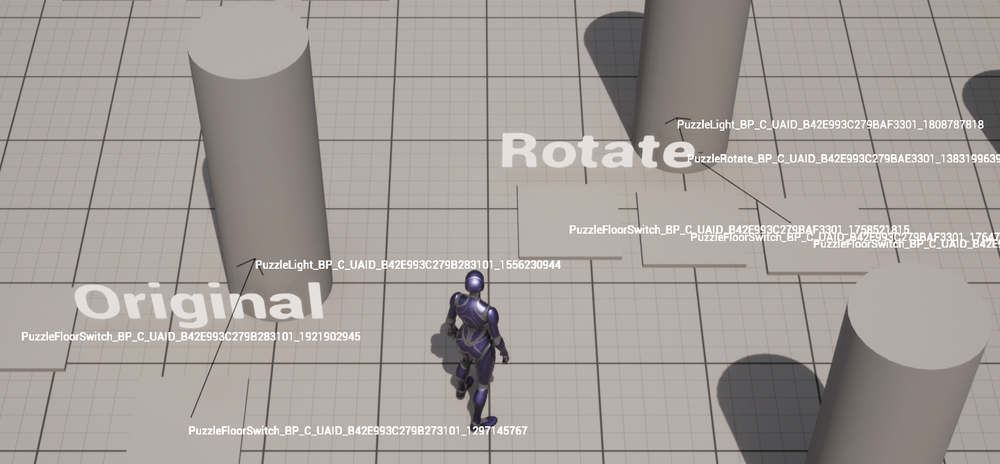

# Improving Debug Visualization

First, in `UPuzzleComponent::DebugDrawOutput`, add a separate `if` that checks for `IsRegistered()`, regardless of whether or not the `OutputActor` is set. If this is true, add a call to `DrawDebugString` that draws the owner's name at its actor location. You can use `GetOwner()->GetName()` to get the name of the owner. You will also need to pass in `0.1f` as the duration.

This will look something like this in game:



## Adding a Console Command

Now we're going to add a console command to enable and disable this debug view (which we'll want disabled by default.

There's a very simple way to add "automatic" console variables. Add the following code to the global scope of `TopDownHUD.cpp`:

```c++
static TAutoConsoleVariable<int32> CVarDebugPuzzles(
	TEXT("DebugPuzzles"), // Console command
	0, // Default value
	TEXT("Turns puzzle debug view on/off (off by default)"), // Help text
	ECVF_Default); // Flags
```

Now in `DrawHUD`, only do the loop over all the puzzle components if `CVarDebugPuzzles.GetValueOnGameThread() != 0`.

Now when you run, by default the debug visualization will be disabled.

To enable the debug visualization, while you're running in editor, press the `~` key to bring up the console and type `DebugPuzzles 1` and press ENTER.

Alternatively, in the editor you can click on the "Enter Console Command" input box at the bottom and enter the command that way.

Once this is done, you're ready to [submit](03-04.html).

