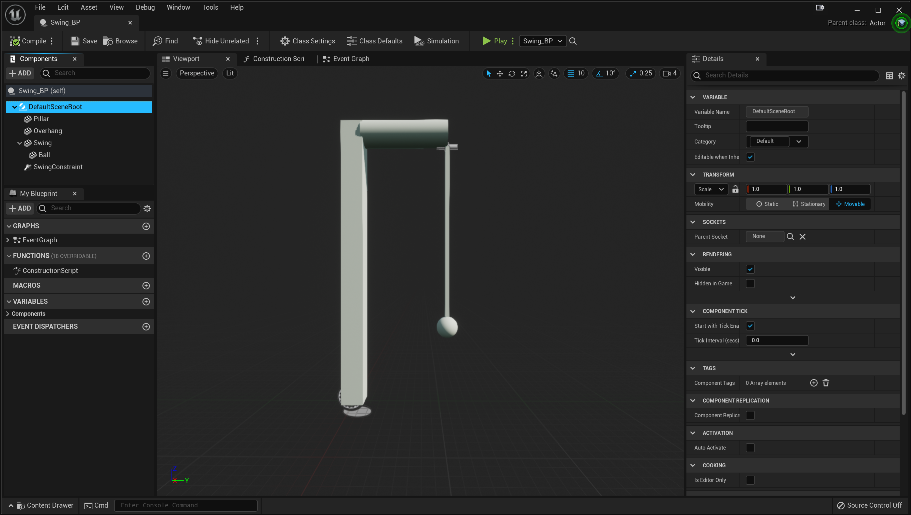
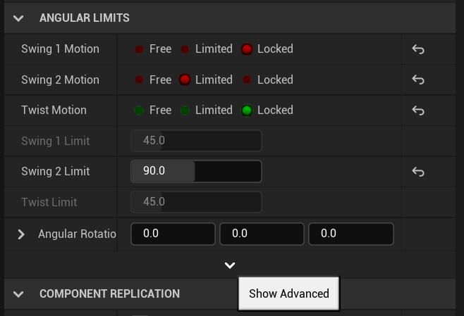

# Swing

In this part of the assignment, you're going to setup a object with a pendulum-like swing, and then connect it to a sequence that rotates the based of the swing.

## Fixing Collision on the Pillar Mesh

Open up the `Pillar_50x500` mesh in StarterContent/Architecture.

In the details find Collision Complexity and change it to "Simple and Complex".

Next, add in the Collision menu, add a "Box Simplified Collision" and save the mesh.

We made this change because meshes used in physics are more efficient if they have simplified collision.

## Swing_BP

Under Puzzles, create a Blueprint subclass of Actor called `Swing_BP`. You're going to add several static mesh components and one physics constraint component so it looks like this:

We'll only enable physics simulation on the "Swing" static mesh component, everything else will stay fixed.

Here's how to get this setup:

- Pillar (Static Mesh) is attached to the root. It uses `Pillar_50x500` as the static mesh. Set the scale to (0.5, 0.5, 0.65)
- Overhang (Static Mesh) is attached to root. It uses `Shape_Pipe` as the static mesh. Move it so it's positioned towards the top as in the image
- Swing (Static Mesh) is attached to the root. It uses `Pillar_50x500` as the static mesh. Set the scale to (0.1, 0.1, 0.4). You also need to change the Y axis rotation to 180 so that the pivot is at the top of the pillar instead of the bottom. Move it so it's positioned to be roughly hanging off the overhang. This should have "Simulate Physics" enabled. Also, check the Mass (kg) box as we'll override the mass to 100kg
- Ball (Static Mesh) is attached to Swing. It uses `Shape_Sphere` as the static mesh. Position it so it's hanging off the bottom of Swing. Set the scale to (2.5, 2.5, 0.625)
- SwingConstraint (Physics Constraint) is attached to root. It should constrain between Overhang and Swing. Remember that you need to position it where you want the joint to be between the Overhang and Swing. Leave the Linear Limits at their default settings. Under angular limits, configure it so Swing 1 and Twist is locked, but Swing 2 is Limited and the limit is 90:
  
  Additionally, click the down arrow to show the advanced options and under "Swing Limits" uncheck "Soft Constraint."

Now place an instance of `Swing_BP` in the level. Test it out by running the player into the swing. If it's working as expected, it should look something like this:

<video style="display:block; margin: 0 auto;" width="640" height="360" controls>
  <source src="assets/Swing.mp4" type="video/mp4">
</video>

## Adding a Sequence

You're going to add a looping sequence that keeps rotating the Swing around the Z-axis. Then you'll set it up so that if you stand on a pressure plate, it will rotate until you step off.

Create a new sequence called `Spin_SEQ`. Add a track for the `Swing_BP` in the editor. After you add it, you won't see a "Transform" track like in the video. However, you can click the + button to the right of `Swing_BP` in the sequencer editor and select Transform to add one.

Put in two keyframes for the Yaw value of the rotation, one at frame 0 and one at frame 120. For the keyframe at frame 120, set the rotation to 360. Adjust the duration of the sequence to be 120 frames.

Additionally, right click on the two red keyframe circles you added and change the "Key Interpolation" to linear. This will make them look like triangles. We want it to be linear so it doesn't have a cubic easing, but instead interpolates at a constant speed.

Confirm that when you scrub in the sequence you see the Swing rotate about the Z axis.

Save this sequence and add an instance to the level. Under the details of the `Spin_SEQ` level sequence actor placed in the level, under "Playback" change the "Loop" option to "Loop indefinitely".

## Playing the Sequence

Duplicate the `PuzzlePlay_BP` we made in the flipped classroom, and name it `PuzzlePlayLoop_BP`. Change the blueprint script so that instead of calling "Play Reverse" when the input value is `false`, it calls "Pause" to pause the sequence.

Now place a `PuzzlePlayLoop_BP` in the level, and have it point to the `Spin_SEQ`. Then place a pressure plate in the vicinity of the swing (though not right next to it), and set its output to your PuzzlePlayLoop.

Test this out now. It should _mostly_ work, but you'll notice that if you start rotating it without first touching the swing, the swing will stay in its original spot until you touch it again. The reason this happens is because the swing is asleep, and the rotation in the sequence doesn't wake it up automatically.

## Waking Up the Swing

It's possible to trigger blueprint events on actors from within the sequence itself, so we'll take advantage of this to wake up the swing when the sequence starts.

Open back up `Spin_SEQ`. To the right of the `Swing_BP` track, click the + button and select Event>Trigger. This will add a new Events track under `Swing_BP`. Scrub to frame 0 and add a new Event keyframe there.

Right click on this Event keyframe go to Properties and under Events select "Create New Endpoint." This will automatically create a new event in the Sequence Director blueprint graph.

Drag off "Swing BP" and type "Wake Rigid Body". Pick the one that says "Wake Rigid Body (Swing)" and hook up that function call.

Compile and save this blueprint and the sequence, and now run your game.

Although this sort of works, it still is glitchy.

## Disabling Sleeping

Instead, we can will change it so the swing just never falls asleep.

To do this, in the content drawer right click and create a Physics>Physics Material. Name this material `PM_Awake`. In here, set the three "Sleep ..." variables all to 0 and save the physics material.

Now, back in `Swing_BP`, select the "Swing" component and set the "Phys Material Override" to `PM_Awake`.

Now the swing will never fall asleep, and it'll look something like this:

<video style="display:block; margin: 0 auto;" width="640" height="360" controls>
  <source src="assets/SpinSeq.mp4" type="video/mp4">
</video>

Now that we've setup the swing, let's [set things on fire](04-02.html).

