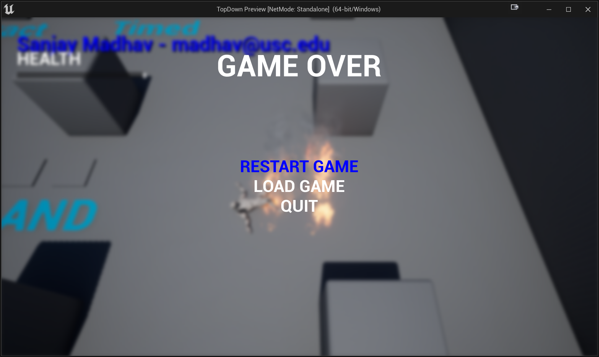

# Game Over Menu

In this part, you'll setup a menu that shows up when the player dies.

## Basic Menu Setup

First, replicate the menu as outlined in the lecture notes this week. This means you'll need to implement TopDownMenu and TopDownButton in C++, as well as the blueprint widgets.

_Note_: You will need to manually add the "SlateCore" additional dependency to your .uproject as on Slide #66 of the UMG lecture notes.

Make it so the game only adds the menu to the viewport once the player dies (so don't do it in OnPossess).

## Changes to the Menu

Now make the following changes to the menu:

- Increase the font size of the button's text in the TopDownButton blueprint to 40
- Change the first button in the menu to say "RESTART GAME" instead of "NEW GAME"
- Make the "RESTART GAME" delegate in the blueprint do the following:
  - Set the input mode back to Input Mode Game Only (you can do this on the player controller)
  - Reload the current level by using "Get Current Level Name" and "Open Level (by Name)"
- In the menu widget, add text near the top and centered that says "GAME OVER" in size 72 font
- In the menu widget, add a "Background Blur" widget to the background with a blur strength of 5

Now when you die, your game over menu should look roughly like this:

Confirm that the options do the following:

- Restart Game should reload the level with the player alive again and at the starting point, and you should be able to control the player again once it restarts
- Load Game should just output the print text debug (like in the lecture notes)
- Quit should end the PIE session

With the game over menu in, you'll add mouse support to the menu in [part 2](06-02.html).

