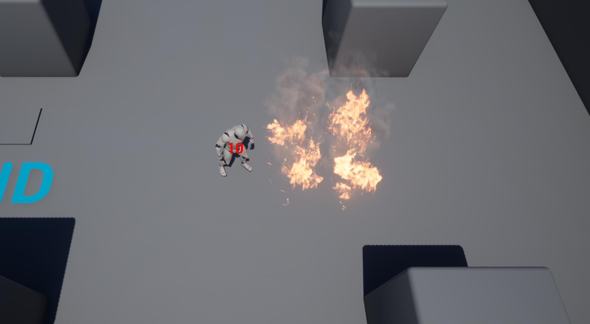
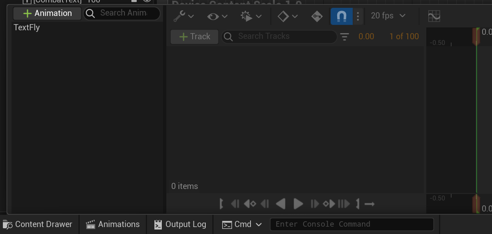

# Combat Text

In this part, we'll add a widget component to the TopDownCharacter that displays the damage taken, and then flies up above the character as it disappears. When complete, it'll look like this:

<video style="display:block; margin: 0 auto;" width="640" height="360" controls>
  <source src="assets/CombatText.mp4" type="video/mp4">
</video>

## Creating the Basic CombatTextWidget

First, create a `UserWidget` C++ subclass called `CombatTextWidget`. This needs to have a `BindWidget` for a text block, and also a public function called `ShowDamage` which takes in an integer for the amount of damage.

For now, `ShowDamage` should:

- Set the text block to green if the damage amount is negative, red if it's positive
- Set the text to the absolute value of the integer value

Then make a blueprint subclass of `CombatTextWidget` and setup the `BindWidget` text block in there. You'll want to middle anchor the text widget and set the render opacity default to 0 (so it's not visible).

### Adding a WidgetComponent to TopDownCharacter

Since we'll need to access the widget from code, we need to add the `UWidgetComponent` to TopDownCharacter in C++.

- Add a `VisibleAnywhere, BlueprintReadOnly` `TObjectPtr` to a `UWidgetComponent` and call it `CombatTextWidget`
- In the constructor, create this component with `CreateDefaultSubobject`
- Call setup attachment on this component to attach it to the `RootComponent`
- Call `SetWidgetSpace` on this component to change it to use screen space

Then, when you take damage you can use the `CombatTextWidget->GetWidget()` to get the `UUserWidget` which it has. Then cast it to the `UCombatTextWidget` subclass you made earlier, and if the cast succeeds, you can call `ShowDamage` on it.

Lastly, we need to tell the widget component which widget class to use. To do that, in the BP_TopDownCharacter blueprint (under TopDown/Blueprints), in the viewport select the widget component set the Widget Class to the blueprint you made.

Now when you run the game, you should see the text following around the player and then once you take damage, you'll see a red 10 like this:



## Adding an Animation

In the blueprint editor, change your text block so it's "Render Opacity" is 0. This will make the text block invisible by default.

Next, on the bottom bar of the widget editor, click Animations to bring up the animation bar and click the "+Animation" to create an animation called "TextFly":



Then click on TextFly and press the +Track button, selecting CombatText.

The user interface for the animation timeline is quite similar to the interface for Sequencer.

For the combat text track, you add a sub-track for "Render Opacity." Then make a keyframe at the start which with a render opacity of 1. This means when the animation starts, the text will be fully visible. Add another key frame at 0.75s and then at 1s. Make the 1s one have render opacity 0, which means from 0.75-1s it'll start fading out.

If you play the animation, you should see that text become visible for 0.75s and then fade out.

Next, add another sub track for the combat text that adjusts the transform. Place a keyframe for Transform>Translation>Y at the start which will also automatically make one at the end of the animation at 1.0s. At the 1.0s keyframe, set the Y translation to -300.

Now when you play the animation you should see the text also move up. It'll look something like this:

<video style="display:block; margin: 0 auto;" width="640" height="360" controls>
  <source src="assets/WidgetAnim.mp4" type="video/mp4">
</video>

Now we need to hook up this animation in the C++ code for `CombatTextWidget`.

To do this, we can use the `BindWidgetAnim` meta which is very similar to `BindWidget`, but for animations.

First, add the following member variable:

```c++
UPROPERTY(Transient, meta = (BindWidgetAnim))
TObjectPtr<class UWidgetAnimation> TextFly;
```

{: .note }
You may notice that this the widget animation is also marked as `Transient`. This is kind of a weird case, where actually the `UWidgetAnimation` `UPROPERTY` isn't really how the animation is being saved in the blueprint. So it has to be `Transient` because it shouldn't be serialized. If you don't mark it `Transient`, the blueprint will refuse to compile.

Then, in the C++ for `ShowDamage`, you just need to call `PlayAnimation` (which is a member function of `UUserWidget`), passing in `TextFly`.

Back in the editor, compile and save your blueprint widget one last time.

Now when you run, when taking damage you should see the combat text show up and scroll off the screen like in the video at the top of this page.

Once this is done, you're ready to [submit](06-04.html).
