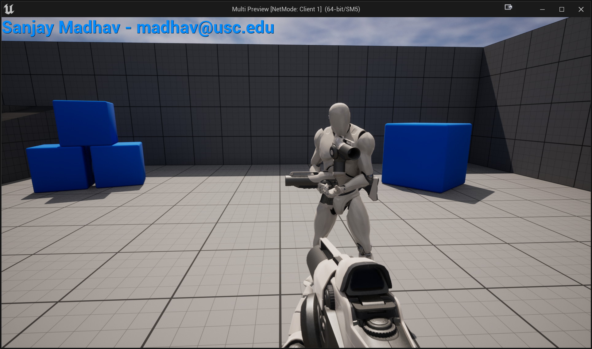
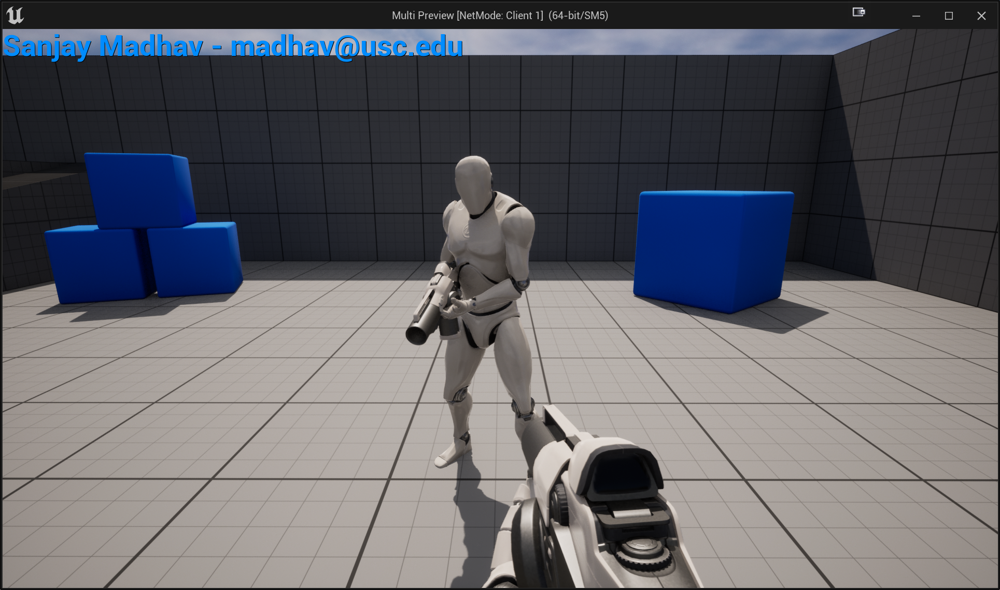

# 3rd-Person Mesh

Since the MultiCharacter was designed for a single player first-person game, it doesn't have a full 3rd-person character model. Furthermore, the arms are disabled for non-owner characters. This means when you see other players in the game, you see just their weapon floating around and not a character. We're going to change it so there's a separate 3rd-person skeletal mesh that you see for the other pawns.

## Adding Animation Starter Pack Assets

You'll need to add the animation starter pack assets to the Multi project. If you don't remember how to do that, you can watch the animation flipped classroom [video](https://youtu.be/wN-SUEirhsc?t=378) for a refresher. Don't forget that once you add the content, you will need to mark them all for add in Perforce. You do not need to reparent the animations as we'll just use the Animation Starter Pack's older Mannequin directly.

## Adding a Mesh3P and Gun3P

We're going add two separate`TObjectPtr<USkeletalMeshComponent>`s to `AMultiCharacter` for both a 3rd person character and 3rd person gun mesh. These will entirely be for visual purposes for the other clients to see the third person character.

Call these `UPROPERTY(VisibleDefaultsOnly)` variables `Mesh3P` and `Gun3P`. You will need to create the components at the end of the constructor, you can use the Mesh1P code as a reference (but make sure you give them unique names):

- Attach them both to the `RootComponent`
- The `Mesh3P` needs a relative rotation of `(0.0f, -90.0f, 0.0f)` and relative location of `(0.0f, 0.0f, -100.0f)`
- The `Gun3P` doesn't need a rotation/location change
- Both of them need to use `SetOwnerNoSee(true)` so that the owner player controller won't see the 3rd person mesh
- You also should leave shadows enabled for both of them (so just don't bother setting those shadow bools).

Now open up the BP_FirstPersonCharacter blueprint in the editor and open the full blueprint editor view:

- Set `Mesh3P` to use `SK_Mannequin` as the mesh and `UE4ASP_HeroTPP_AnimBlueprint` as the anim class
- Set `Gun3P` to use `SK_FPGun` as the mesh

Now when you run, you should be able to see the 3rd-person mesh for your opponent, though you will see two guns and neither are lined up properly:



## Fixing Double Guns

The reason you're seeing two guns is one mesh is the one is the mesh used by the weapon that's spawned in `AMultiCharacter::BeginPlay` and the other is the `Gun3P` we just added. For the 3rd person characters, you only want `Gun3P` to be visible.

To do this, first go into `BP_Rifle_Spawn` and for the `RifleMesh_0` component set the "Only Owner See" property to true.

At this point, if you run you won't see double guns on the 3rd person characters, but you won't see the gun for the 1st person character, either. To fix this, when you spawn the gun you need to say the "owner" is the corresponding character. To do this, change the `SpawnActor` call in `AMultiCharacter::BeginPlay` to the following:

```c++
FActorSpawnParameters Params;
Params.Owner = this;
WeaponActor = GetWorld()->SpawnActor<AActor>(WeaponOnSpawn, GetActorLocation(), FRotator::ZeroRotator, Params);
```

## Fixing the Gun3P Positioning

If you take a look at `AttachWeapon` in `UTP_WeaponComponent`, you'll see that it attaches the owner to the `"GripPoint"` socket on `Mesh1P`. Sockets are a way to add a named attachment point to the skeleton hierarchy. If you open up `SK_Manneuqin_Arms_Skeleton`, you'll see the `GripPoint` socket below `middle_01_r`.

Luckily, since the first person model is still using the normal Unreal humanoid bone hierarchy, we can just copy over this socket to `UE4_Manneuqin_Skeleton` as well. First, right click on `GripPoint` and say "Copy Socket." Then, open up `UE4_Mannequin_Skeleton`, right click on `middle_01_r`, and paste it and save the skeleton.

Now in the `AMutliCharacter::BeginPlay` regardless of the role, attach the `Gun3P` to `Mesh3P` at the `GripPoint` socket (emulate that code in `AttachWeapon`).

If this works, then you'll see the other player holding the gun, and it'll move around with them as expected, like this:



## Adding a Fire Animation

Finally, you want to make it so the 3rd person mesh plays an animation when a non-local player fires. To do this, add an additional `UPROPERTY` in `TP_WeaponComponent` for an animation montage for the `FireAnimation3P`, and play it on the 3P mesh in the multicast function (you may need to add a getter for `Mesh3P`).

Then, in editor you'll first need to add a Default Slot to the Animation Graph for `UE4ASP_HeroTPP_AnimBlueprint` between the Locomotion state machine and the output pose. Then, make a montage out of `Fire_Rifle_Hip`. In the montage's properties, you'll have to set the "Blend In" blend time to 0.01 to see the animation properly (because the animation is only 0.26s long, if you leave it as the default of 0.25s you won't see it). Then set the `FireAnimation3P` property to the montage in the `BP_Rifle_Spawn` blueprint.

If this works, you should see the 3rd-person character also play an animation:

<video style="display:block; margin: 0 auto;" width="640" height="360" controls>
  <source src="assets/08-01.mp4" type="video/mp4">
</video>

Next, you'll add teams and scoring in [part 2](08-02.html).
