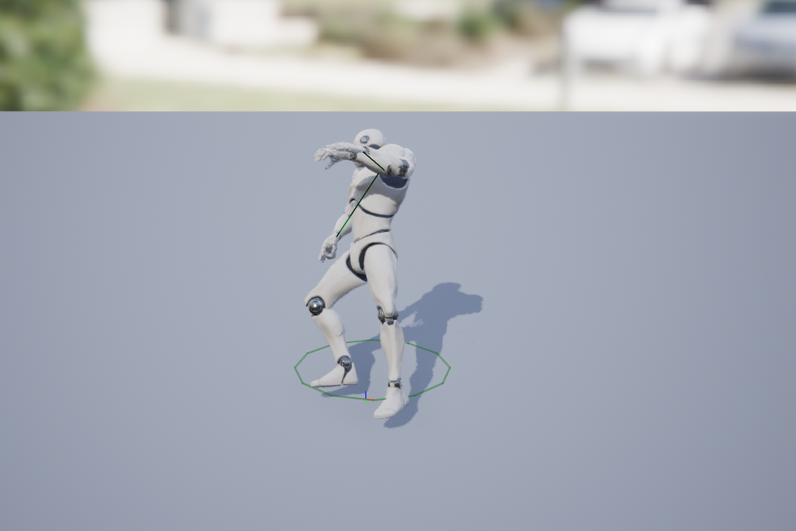

# Death and Respawning

In this part, you'll implement behavior where a player dies when they get hit and then respawns. Most of the logic regarding death can be handled on the server, and you'll only need to play the animations and showing the respawn timer on the client.

You can test this all in normal PIE again (you don't need to launch standalone).

## Die

Make it so that `AMultiCharacter` has a replicated bool `bIsAlive`, which is `true` if they're alive or `false` if dead. Then when the projectile hits an opponent, it should only add to the score if the character is still alive. Then it should "kill" the character by setting the bool.

Verify that when a character gets takes damage from a projectile, any further projectiles won't add to the score.

Next, you want to make sure that the character can't move anymore once dead. To do that, when they die, also call `DisableMovement` on the CMC (this happens on the server). Also, change `UTP_WeaponComponent::Fire` so it does nothing if the character is dead. Finally, also change  `AddControllerYawInput`, `AddControllerPitchInput`, `TurnAtRate`, and  `LookUpAtRate` in `AMultiPlayerController` so they don't do anything if the character is dead.

{: .note }
Changing the rotation functions to not do anything is only being enforced on the client with this method.

## Death Animation (3rd Person)

Animation montages do not replicate. So to see a death animation, you need to play the montages on all clients. You can do this by changing `bIsAlive` to use a RepNotify. Then when the value is replicated, if it's false (eg. they're dead) you can play an anim montage on the 3rd person mesh. Make a montage out of your favorite death animation.

Unfortunately you'll have the problem where the character will pop back up once the animation finishes. You can fix this in a similar manner like you did for `TopDownCharacter` dying (with a gameplay timer that triggers towards the end of the montage), except using `Deactivate()` on the mesh will not work due to replication. Instead, you must call `Montage_Pause` on the AnimInstance, as each client is allowed to manage its own AnimInstance. You will need to set the blend out time of the anim montage to 0.0 as `Montage_Pause` will not work if the montage is already blending out.

If this works, it'll look like this:


## Fixing Collision

You may notice that when the characters die you still can't move through where their capsules are and if you shoot at the old capsule locations the projectiles will disappear, too. You can see why this is the case if you use the `show collision` console command:


To fix this, you need to have the disable collision on the capsule when the character dies.

```c++
GetCapsuleComponent()->SetCollisionEnabled(ECollisionEnabled::NoCollision);
```

You need to call this on both the server ***and*** the client, as it won't automatically replicate. So you'll need to do it both on the server and in your RepNotify.

Now verify that when you kill an opponent their capsule isn't still blocking you.

## Death Animation (1st Person)

To get the death animation to work in 1st person, you first will need to retarget a Death Animation to work with the arms mesh. To do this:

1. Open SK_Mannequin_Arms_Skeleton
   1. Go to Window>Asset Details
   2. Under "Compatible Skeletons" add "UE4_Mannequin_Skeleton"
2. Next, you need to create an "IK Rig" for both SK_Mannequin_Arms_Skeleton and UE4_Mannequin_Skeleton:
   1. You can do this in FirstPersonArms/Character/Mesh. Just right click on an empty space in the content drawer and select Animation>IK Rig, and select the appropriate skeletal mesh
   2. Call one IK_Mannqeuin_Arms and the other IK_Mannequin (corresponding to each mesh)
   3. Open both IK Rigs, and in each one:
      1. Right click on "pelvis" in the hierarchy and select "Set Retarget Root"
      2. Click on the "IK Retargeting" tab and add two new chains: ArmLeft from clavicle_l to hand_l and ArmRight from clavicle_r to hand_r. It will look like this:
         
      3. Save the IK rig
3. Now right click on empty space in the content drawer and select Animation>IK Retargeter
   1. The "from" should be IK_Mannequin
   2. Call it IK_Retargeter_ToArms
   3. Open the IK_Retageter_ToArms and under "Target IKRig Asset" select IK_Mannequin_Arms
   4. Under the "Chain Mapping" section below, click "Auto-Map Chains"
   5. Now click the "Asset Browser" tab. Double-click on one of the death animations and confirm that the retargetting seems roughly correct (it may not match 100% but it's close enough):
      
   6. Click "Export Selected Animations" and save it under Content/FirstPersonArms/Animations
4. Make a montage from this retargetted death animation. Meka sure to set the "Blend Out" time to 0.0
5. In FirstPerson_AnimBP, you will need to add a 'Default Slot' to the animgraph, immediately after the Slot 'Arms' node and before Output Pose

Now that you have the working 1st person animation montage, the code will work like the 3rd person death animation.

The animation won't look particularly great because the camera doesn't change when you die, but it's good enough for now.

## Respawning

{: .warn }
Before you do this part, make sure that `ChoosePlayerStart_Implementation` does successfully find `UnOccupiedStartPoints`. Try putting a breakpoint on the line that adds to that `TArray`. If you never hit it, even when spawning in, it likely means your  your player starts are slightly clipping into the ground. Try raising them a little bit and confirm you do find unoccupied start points after that change.

Now make it so once a player dies, they respawn after 5 seconds. To respawn properly requires you to do these three things (in order) on the server:

1. Call `UnPossess` on the controller, which says the controller no longer controls that old pawn

2. Call `RestartPlayer` on the GameMode, passing in the player controller to respawn

3. Call `Destroy` on the old character

*Hint*: It's easiest to just do all three of these from inside MultiCharacter, just have a gameplay timer trigger these three actions after 5 seconds when the character dies.

When implemented, it should look like this:

<video style="display:block; margin: 0 auto;" width="640" height="360" controls>
  <source src="assets/09-02.mp4" type="video/mp4">
</video>

## Preventing Spawn Camping

Right now, opponents just respawn at the set spawn spot so you can camp the spawn point easily.

To prevent this, add two additional player starts to the corners of the level which don't already have red/blue player starts (so 4 new player starts, in total). Assign these player starts the `PlayerStartTag` of `"Backup"`.

Now change `ChoosePlayerStart_Implementation` so it makes an additional array called `BackupStartPoints` for PlayerStarts with tag "Backup". In the loop, you need to add the backup player starts to `BackupStartPoints`.

Then, after the loop you need to remove from `UnOccupiedStartPoints` and `OccupiedStartPoints` any PlayerStarts which there's a player of the opposing team within 1000 units.

Then, when it's time to set `FoundPlayerStart`, if both `UnOccupiedStartPoints` and `OccupiedStartPoints` are empty, use `BackupStartPoints` instead and pick a random one from there.

*Hints*:

- You can use a `TActorIterator<AMultiCharacter>` to iterate over all the characters in the world (just like how the loop in this function iterates over the `APlayerStart`s).
- See the [Unreal Documentation](https://docs.unrealengine.com/5.0/en-US/array-containers-in-unreal-engine/#removal) for how to remove from a `TArray` using `RemoveAll` which removes all nodes which satisfy the lambda condition (where the parameter to the lambda should match the type stored in the `TArray`). If you can't figure out how to use `RemoveAll`, you can remove manually using one of the other removal functions.

If this works as expected, then when you kill players if you're near their spawn zone they'll spawn at a backup spot, otherwise they'll spawn at their spawn zone:

<video style="display:block; margin: 0 auto;" width="640" height="360" controls>
  <source src="assets/09-02-2.mp4" type="video/mp4">
</video>

Once that's done, it's time to move on to the (relatively short) [part 3](09-03.html).
