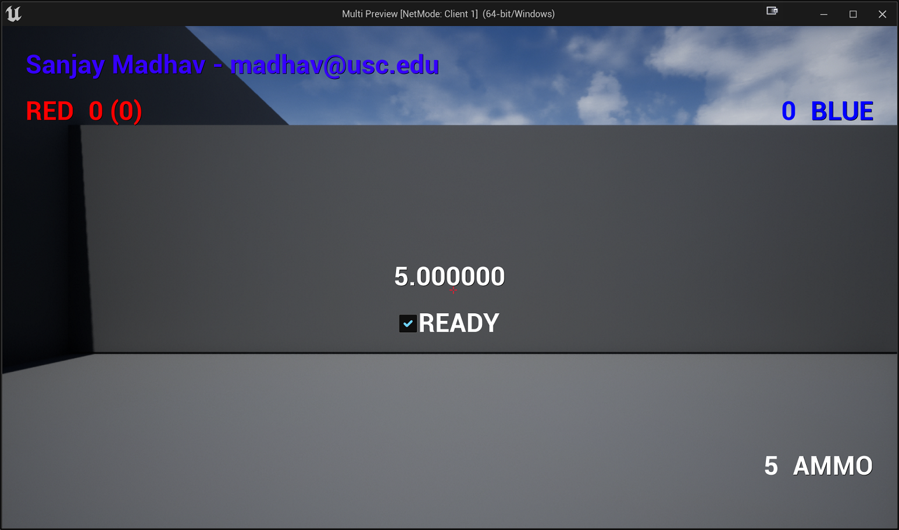

# Ready Check

For this last part, we're going to change it so instead of the game immediately starting, it will only start once all players check a "ready" checkbox. This will be important for the next assignment where we'll actually have players join from different machines.

## Adding the Checkbox

In the `HUDWidget_BP`, add a Check Box element called `ReadyCheckBox`. Make a text box that says "READY" and make it a child of the `ReadyCheckBox`. Here's some notes on how it should look:

- Position it in the center, slightly below where the timer is (as they'll both be visible simultaneously)
- Make the text size `42`
- In the checkbox properties under "Style", change the "Image Size" for all the Unchecked and Checked images (all 6) to be 40x40. Otherwise the checkbox is too tiny
- Also set the checkbox to "size to content"

Verify in-game that your check box looks something like this (if you click on it to check it):

## Delaying the Start

Recall that right now, the `MultiGameState` `Tick` will decrement from the `WaitingToStartTime` as long as you're in the `WaitingToStart` match state. For the ready check to work, you'll need to change it so it also checks to make sure that all players are ready before decreasing `WaitingToStartTime`.

Since we know the game state tick is running on both server and client, you will need a replicated integer that tracks how many players are ready.

Then, only decrement from `WaitingToStartTime` if both the `PlayerArray` has more than 0 players and the number of players ready is equal to the number of players in the `PlayerArray`.

Because you haven't actually added support for readying up yet, the net result of implementing this is, for now, the match won't start.

## Making it Possible to Check the Box

You need to set it up so that when you create the HUDWidget in MultiPlayerController, you set the input mode to UI only. Then in `ClientOnPossess_Implementation`, set the input mode to game only. This will allow you the ability to check the box prior to game start and then when the game starts, control will go to the player input.

{:.note}
This does mean that when you kill a player and they respawn, your input will switch to the player who respawned.

## Checking the Box

Now you need a way for the client to tell the server whether or not it's ready, so that the server can properly update its count of ready players. Keep in mind that players can uncheck this as well (which will pause the countdown timer), so you need to account for that in your server function. I'd recommend adding the server function for this to `MultiPlayerState`.

Then, in C++ you need to hook up the `OnCheckStateChanged` delegate on the `ReadyCheckBox` in the HUDWidget.

If you got this working, you should be able to get the countdown timer to start if all the clients check READY and then the match start when the timer hits 0. You should also confirm that unchecking the READY box will pause the timer.

{:.note}
It's expected there may be a slight inconsistency between the server's actual `WaitingToStartTime` and the client's predicted value, due to replication delay. However, it will be close enough that it will be fine.

## Hiding the Checkbox

Finally, in code make it so that `ReadyCheckBox` is set to `Visible` if the match state is `WaitingToStart`, and otherwise `Hidden`.

The final version of the ready check should look like this:

<video style="display:block; margin: 0 auto;" width="640" height="360" controls>
  <source src="assets/10-3.mp4" type="video/mp4">
</video>

Now it's time to [submit](10-04.html)!
