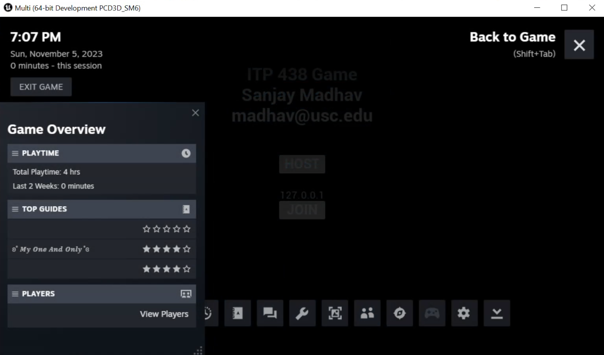

# Setup

In this part, you'll enable Steam in the project and set it up so the "Host" and "Join" button use Steam instead of direct IP address connections.

### Installing Steam

Make sure Steam is installed on the machines you want to test on. It's not installed on your VM by default, but you can go to [https://steampowered.com](https://steampowered.com) to download it.

You'll need to have two steam accounts to be able to test functionality later in this assignment. If you don't have two accounts, create a second account and have your original account send a friend request to the second account. Keep in mind you are allowed to have multiple steam accounts associated with the same email address.

Then just make sure each machine you are testing on is logged into Steam with the appropriate account.

## Adding Dependencies

First, we need to let UBT know that Multi will depend on the OnlineSubsystem and OnlineSubsystemSteam modules. To do this, open the Multi.Build.cs file (It will be under Multi\Source\Multi).

At the end of the constructor, add the following line to add these two modules as dependencies:

```c#
PublicDependencyModuleNames.AddRange(new string[] { "OnlineSubsystem", "OnlineSubsystemSteam" });
```

Now build and run.

## Enabling Plugins

In the editor, go to Edit>Plugins and under the "Online Platform" category, find "Online Subsystem Steam" and enable it. Go ahead and close the editor.

## Basic Configuration

Now you will need to edit the Multi>Config>DefaultEngine.ini to configure our project to use Steam by default.

First, add the following lines which will tell Unreal that we want to use the Steam network driver, rather than the default IP network driver:

```ini
[/Script/Engine.Engine]
; Using ! and = ClearArray will clear out any existing definitions 
!NetDriverDefinitions=ClearArray
; This says we want to use the Steam NetDriver, if it's available
+NetDriverDefinitions=(DefName="GameNetDriver",DriverClassName="OnlineSubsystemSteam.SteamNetDriver",DriverClassNameFallback="OnlineSubsystemUtils.IpNetDriver")
```

Next, we need to tell the `OnlineSubsystem` that we want to default to using the Steam platform:

```ini
[OnlineSubsystem]
; Use Steam by default
DefaultPlatformService=Steam
```

Next, we need to enable the `OnlineSubsystemSteam` and specify an App ID to use:

```ini
[OnlineSubsystemSteam]
; Enable OSS Steam
bEnabled=true
; Use the 480 (test) AppID
SteamDevAppId=480
; Need to set this to true so we can run listen servers
bInitServerOnClient=true
```

The ID 480 is used by [Spacewar](https://partner.steamgames.com/doc/sdk/api/example), which is the Steamworks SDK sample. If you were making a real game, you would pay the $100 to get your game listed on Steam, and Valve would give you your own (different) App ID.

With this configuration, you can now test that your game will launch with Steam, but you need to do so in a standalone build. To do this, you will need to create a new package and then launch Multi from the package.

{:.warn}
Keep in mind that Steam does not initialize in editor builds. This is why you have to test in standalone to test whether Steam initializes successfully.

If Steam was successfully initialized, you should see the Steam Overlay indicator in the bottom right corner of the window, and then if you press SHIFT+TAB, it will show an overlay that says you're playing Spacewar:



## Debugging Standalone

Sometimes you want to be able to step through the Standalone package game in the debugger. You can actually launch directly into a Standalone build from Visual Studio or Rider, assuming you have made a package with all the latest content first:

* In Visual Studio, change the configuration to "DebugGame" instead of "DebugGame Editor"
* In Rider, change the configuration to "Game DebugGame"

1. Go to Debug>Attach to Process...
2. In the "Filter processes" search field, type `Multi`
3. Double click on the process that shows the title "Multi (64-bit Development PCD3D_SM5)"
4. You will now be attached to the game in the debugger and can see log output in the "Output" window, place breakpoints, step through code, etc

## Creating MultiOnlineSystem

Once you confirm your standalone game launches in Steam, go ahead and close it and launch the editor again.

Make a C++ subclass of `GameInstanceSubsystem` and call it `MultiOnlineSystem`.

Once the files are created, close the editor.

In the code, add an override of the Initialize function from USubsystem.

Next, add three public `BlueprintCallable` functions that take in no parameters:

- `HostSession`
- `FindAndJoinSession`
- `EndSession`

Add stub implementations for everything and make sure your code compiles.

## Getting the Session and Friends Pointers

Back in the header, add an include for `"OnlineSubsystem.h"`, then in the private data add the following member variables:

```c++
IOnlineSessionPtr SessionInterface;
IOnlineFriendsPtr FriendsInterface;
```

The `IOnlineSessionPtr` is just a typedef for a `TSharedPtr` to a session interface. `TSharedPtr` is basically like a C++11 shared pointer.

We need to set these pointers from the OnlineSubsystem. To do this, add the following code to `UMultiOnlineSystem::Initialize`:

```c++
// Get the OnlineSubsystem
IOnlineSubsystem* OSS = IOnlineSubsystem::Get();
// Get the session interface, if it exists
SessionInterface = OSS ? OSS->GetSessionInterface() : nullptr;
if (SessionInterface)
{
	// We got a session interface, do something with it!

}

FriendsInterface = OSS ? OSS->GetFriendsInterface() : nullptr;
if (FriendsInterface)
{
	// We got a friends interface, do something with it!
    
}
```

Then, in `UMultiOnlineSystem::Deinitialize`, add the following:

```c++
if (SessionInterface)
{
	// Do any cleanup as needed!

}

// We no longer need to hold a strong reference to the interfaces
SessionInterface = nullptr;
FriendsInterface = nullptr;
```

## Binding Delegates

Add includes for `"Interfaces/OnlineSessionInterface.h"` and `"Interfaces/OnlineFriendsInterface.h"` to MultiOnlineSystem.h.

If you open up OnlineSessionInterface.h, you'll see that there are several typedef delegates at the start of the file. We will need to create functions to bind to these delegates. Note that the delegates are not dynamic, meaning they are C++ only delegates.

For example, here is the declaration for `FOnCreateSessionComplete`:

```c++
/**
 * Delegate fired when a session create request has completed
 *
 * @param SessionName the name of the session this callback is for
 * @param bWasSuccessful true if the async action completed without error, false if there was an error
 */
DECLARE_MULTICAST_DELEGATE_TwoParams(FOnCreateSessionComplete, FName, bool);
typedef FOnCreateSessionComplete::FDelegate FOnCreateSessionCompleteDelegate;
```

In order to bind to this delegate, you will need to create a member function in `UMultiOnlineSystem` that takes in two parameters, an `FName` called `SessionName` and a `bool` called `bWasSuccessful` (the suggested names are from the comments above).

So, add the following declaration to MultiOnlineSystem:

```c++
// Used to bind to FOnCreateSessionComplete delegate
void OnCreateSessionComplete(FName SessionName, bool bWasSuccessful);
```

Then add a stubbed implementation of the function in the cpp.

Next, in `Initialize`, inside the `if (SessionInterface)` check, add the following line to bind your function to the delegate:

```c++
SessionInterface->OnCreateSessionCompleteDelegates.AddUObject(this, &UMultiOnlineSystem::OnCreateSessionComplete);
```

{:.note}
You use `AddUObject` to bind these delegates instead of `AddDynamic` because these delegates are _not_ dynamic so they do not support blueprint bindings.

Then in `Deinitialize`, also inside the `if (SessionInterface)` check, add the following to unbind the delegate:

```c++
SessionInterface->OnCreateSessionCompleteDelegates.RemoveAll(this);
```

Make sure your code compiles.

Now, similarly add bindings to these additional delegates:

- `FOnStartSessionComplete`
- `FOnEndSessionComplete`
- `FOnSessionUserInviteAccepted`
- `FOnFindFriendSessionComplete` - For this one, you'll have to use `AddUObject` on `OnFindFriendSessionCompleteDelegates[0]` (since it's an array)
- `FOnJoinSessionComplete` - Note there seems to be a copy/paste error with the comment here, I called the second parameter `Result` instead of `bWasSuccessful` (since it's not a `bool`)

Once your code is stubbed out and compiles, we'll change the main menu buttons to host and join Steam sessions in [part 2](11-02.html).

