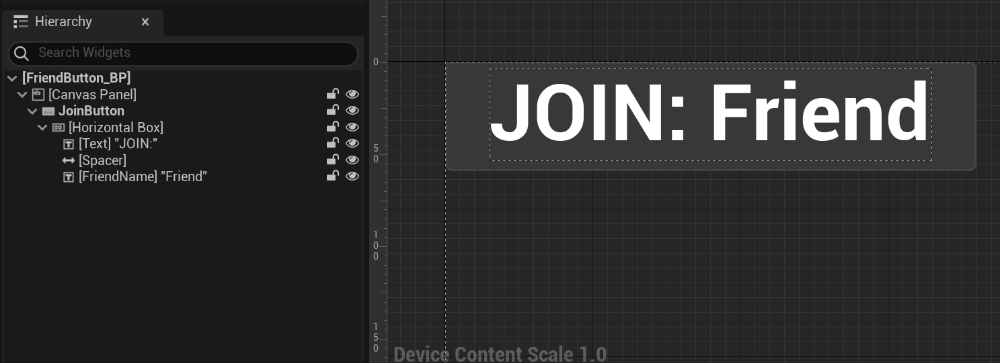

# Friends UI

Right now, the "Join" button just picks the first player on your friends list who's playing the game. This is fine for our testing where there's only a single friend who's playing, but for it to work better we want to have a way to list who all is playing and be able to pick which friend to join. Furthermore, we want a way to refresh the list (as right now, we just ask for the friends list once on initialize and that's it).

## New Widget Classes

Back in the editor, create two new C++ classes that are children of UserWidget:

- `MainMenuWidget`
- `FriendButtonWidget`

Close the editor and reload the Visual Studio Project. We just need to setup a couple of member variables:

- In `MainMenuWidget`:
  - Add a `BindWidget` `UButton` called `RefreshButton`
  - Add a `BindWidget` `UVerticalBox` called `FriendBox`
  - Add a `TSubclassOf<class UFriendButtonWidget> FriendButtonClass;`
- In `FriendButtonWidget`:
  - And a `BindWidget`  `UButton` called `JoinButton`
  - Add a  `BindWidget` `UTextBlock` called `FriendName`
  - Add an `int` called `FriendIndex`

Now back in editor, reparent `MainMenu_BP` to `MainMenuWidget`. Remove the "JOIN" button and instead make a new Button called `RefreshButton` (with the text "REFRESH"). Below the Refresh button, but still inside the main vertical box, create another Vertical Box called `FriendBox`. Add a spacer between the refresh button and friend box. This should look roughly like this:


Then, make a FriendButton_BP that inherits from FriendButtonWidget:

- Add a Canvas Panel
- Add a Button called JoinButton and set it to "Size To Content"
- As a child of JoinButton, add a horizonal box
- In the horizonal box, add:
  - A Text that says "JOIN:" with a font size 32
  - A Spacer with x size 10
  - A Text named `FriendName` and says "Friend" with a font size 32


This will look like something this:



Then, back in the `MainMenu_BP`, go to the Blueprint Graph. In the Details panel on the left, set `FriendButtonClass` to `FriendButton_BP`.

Once the blueprints are saved, close the editor.

## New Functions to MultiOnlineSystem

Add the following two public declarations to MultiOnlineSystem.h:

```c++
// Reads the friends list and triggers the delegate when complete
void ReadFriendsList(const FOnReadFriendsListComplete& Delegate = FOnReadFriendsListComplete());

// Returns the names of the friends which were recieved on the last successful ReadFriendsList
TArray<FString> GetFriendsListNames();

// Try to join the friend session of FriendNum, if it's a valid index in the friends list
void JoinFriendSession(int FriendNum);
```

Then add implementations to the cpp:

- `ReadFriendsList` is just a direct wrapper for the `FriendsInterface` function, just pass along the delegate
- `GetFriendsListNames` will first need to call `GetFriendsList`, and then loop over that array and call `GetDisplayName()` on each `FOnlineFriend` to populate the return value array
- `JoinFriendSession` is literally just the implementation of `FindAndJoinSession`, except it takes in an index. You can just copy/paste the code from `FindAndJoinSession` and just index the specified index, rather than just hardcoding to `FriendsList[0]`. You'll want to use `IsValidIndex` to make sure `FriendNum` is a valid index in the array
- Change `FindAndJoinSession` to just call `JoinFriendSession(0)`

## Refresh Button On Clicked

Now in MainMenuWidget, you need to bind to the `RefreshButton` `OnClicked` delegate (in C++). Remember the function you bind to it needs to be a `UFUNCTION`.

Also make a member function (not a `UFUNCTION`) that matches the `FOnReadFriendsListComplete` delegate signature.

In the Refresh Button On Clicked delegate, you want to:

1. Call `FriendBox->ClearChildren()` to remove any children in the `FriendBox`
2. Call `ReadFriendsList` on the `UMultiOnlineSystem`, passing in a delegate object that binds to the `OnReadFriendsListComplete` function you made

Then, in your `OnReadFriendsListComplete` function, if `bWasSuccessful` is `true`, you want to:

1. `GetFriendsListNames`
2. For each friend name:
   1. Create an instance of the friend button widget
   2. Add the button to the vertical box
   3. Set the button's `FriendName`
   4. Set the button's `FriendIndex` to correspond to the index in the friends list

Now test with the two machines. It should be the case that if no friends are hosting, clicking "Refresh" won't add any entries. However, if a friend is hosting, clicking "Refresh" should add an additional button to join that friend, which will look something like this:


You may notice that, right now, even friends who are in the main menu, but not hosting a game will still show up as joinable. We will fix this in a little bit.

## Show the List on Initial Load

When you construct the main menu, manually call the function that you call when the refresh button is clicked. That way, if the player starts the game and they already have a friend playing, they can skip having to click refresh and can join immediately.

## Joining the Game

The last step is in `FriendButtonWidget` is to bind to the `JoinButton` `OnClicked` delegate. You just need to call `JoinFriendSession` on the MultiOnlineSubsystem, passing in the `FriendIndex`. You should now confirm that you can join the game as expected.

## Fixing When Steam Thinks Your Game is Joinable

By default, Steam will think your game is joinable even when you're in the main menu. We're going to change it so that initially we tell Steam that your game is not joinable, and then only once you start hosting or playing a game will it say your game is joinable.

To do this, first add the following function to MultiOnlineSystem:

```c++
void UMultiOnlineSystem::SetPresenceJoinable(bool bIsJoinable)
{
	IOnlineSubsystem* OSS = IOnlineSubsystem::Get();
	// Query our presence and set the game to not joinable
	IOnlinePresencePtr PresenceInterface = OSS ? OSS->GetPresenceInterface() : nullptr;
	IOnlineIdentityPtr IdentityInterface = OSS ? OSS->GetIdentityInterface() : nullptr;
	if (PresenceInterface && IdentityInterface)
	{
		// Get the UniqueNetID for this player
		auto UserId  = IdentityInterface->GetUniquePlayerId(0);
		// Query the presence (this will return instantly for the local player on Steam)
		PresenceInterface->QueryPresence(*UserId);

		// Now get the cached presence
		TSharedPtr<FOnlineUserPresence> Presence;
		if (PresenceInterface->GetCachedPresence(*UserId, Presence) == EOnlineCachedResult::Success)
		{
			// Set our new presence to the cached presence and update whether we're joinable
			FOnlineUserPresenceStatus Status = Presence->Status;
			Status.Properties.Add(TEXT("Joinable"), bIsJoinable);
			PresenceInterface->SetPresence(*UserId, Status);
		}
	}
}
```

Next, call `SetPresenceJoinable(false)` in `Initialize`, and call `SetPresenceJoinable(true)` in both `OnStartSessionComplete` and `OnJoinSessionComplete`, before traveling to the new level.

If this all works it'll look like this:

<video style="display:block; margin: 0 auto;" width="640" height="360" controls>
  <source src="assets/11-3.mp4" type="video/mp4">
</video>


Once this is complete, it's time to [submit](11-04.html)!
