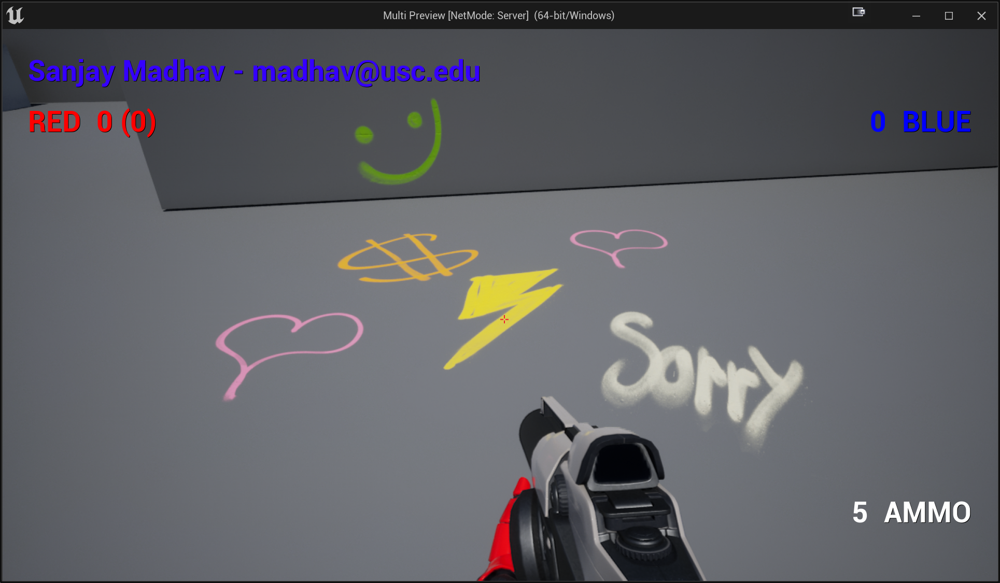
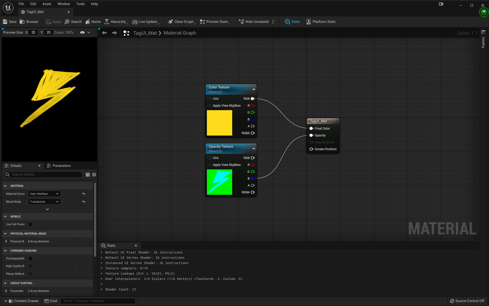

# Switching Tags

In this part, you'll make it so there's different tags that you can switch between using the number keys. Pressing a number from 1-5 will set the current tag, and this will also display in the HUD.

## Mapping 1-5 to Change Tags

Make it so the 1 key maps to the current lightning bolt tag. You can make 2, 3, 4, and 5 map to whichever other tags you like. You'll have to make a different BP class for every type of tag. Then:

- Change it so instead of a single `TSubClassOf` for the `TagActorClass`, you have a `TArray` of them
- Change the `ServerApplyTag` RPC so it takes in a parameter for the desired tag index from the array
- Make it so pressing the 1-5 keys will change which tag gets applied when you apply the tag with `X` (you just need to locally track the current selection with an integer and then when you call `ServerApplyTag` pass in the integer)

Confirm that you're able to spray paint the 5 different tags in game, which will look something like this:



## UI Materials

Now you'll add an image display to the HUD. However, because UI materials are different than decal materials, you can't just directly use the decal materials in an "Image" element in UMG. You'll have to make a new material to do this.

Under Content make a new folder called `Materials`. In here, create a new material called `TagUI_Mat` and open it. In here:

1. Change the "Material Domain" property to "User Interface"
2. Change the "Blend Mode" to "Translucent"
3. Add a TextureSamplerParameter2D node:
   1. Name it "Color Texture"
   2. Hook up its RGB pin to "Final Color"
   3. In the Details, change the "Param" from "DefaultTexture" to `T_Graffiti_Tag_vkzibc3l_2K_D` (this is the diffuse for the lightning bolt texture; it'll look just solid yellow almost, but it's fine)
4. Add another TextureSamplerParameter2D node:
   1. Name it "Opacity Texture"
   2. Hook up just the B pin to "Opacity"
   3. In the Details, change the "Param" to `T_GraffitiTag_vkzibc3l_2K_DpRA` (this is the alpha mask for the tag)
5. Save the material

If you did it properly, it should look like this:



Now you need to make a Material Instance that changes the textures to be the correct ones for each of your four other tags. To do this:

1. Right click on the TagUI_Mat in the Content Drawer and say "Create Material Instance"
2. Rename it something to note which TagUI element it's specifically for
3. In the details, check the boxes next to "Color Texture" and "Opacity Texture" so you can override them, and then point them to the correct diffuse and alpha textures for each of the other tags

Once you've made instances for each of the other tags, you can now use them in the UI.

## Tags in the HUD

In the HUDWidget, you should add an Image element in the bottom right corner of the HUD. Make the size of it 256x256.

In code, you'll need to make the `UImage` element `BindWidget` so that you can dynamically change it. You'll also need to add the following array of material interfaces (to be able to pick from the different materials):

```c++
UPROPERTY(EditDefaultsOnly)
TArray<TObjectPtr<UMaterialInterface>> TagMaterials;
```

In the blueprint properties of the HUDWidget, you'll need to set `TagMaterials` to the correct materials (at their corresponding indices).

Then, make it so when you change your current tag index in the Player Controller, you also tell the HUDWidget to change which material it displays. `UImage` has a `SetBrushFromMaterial` member function for this purpose.

If this all works, you should be able to dynamically change the tag with the 1-5 keys, and then also spray the tags, like this:

<video style="display:block; margin: 0 auto;" width="640" height="360" controls>
  <source src="assets/12-1.mp4" type="video/mp4">
</video>

Now you're ready to add save/loading in [part 2](12-02.html).

